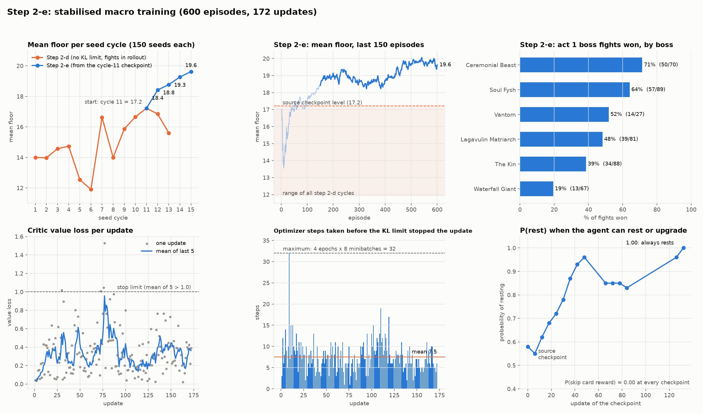

# Step 2-g：稳定后的宏观训练（`runs/step2e-stable`）

*2026-10-04 ~ 10-05*

## 做了什么

用 Step 2-e 的两个稳定措施重新训练宏观策略：

- 起点：Step 2-d 第 11 周期的 checkpoint `update_001052`（Step 2-d 最好的阶段，平均 floor 17.2），用 `--init-from`（Step 2-f）带上整个模型（actor、critic、回报缩放），优化器和计数器重新开始；
- `--search-fights-out-of-rollout`：战斗全部由 MCTS-50 打，并且不进 rollout，每次 256 步的更新全是 PPO 自己的宏观决策；
- `--target-kl 0.02`：每次更新的 KL 超过 0.03 就停止剩下的 epoch；
- 其余和 Step 2-d 相同：学习率 3e-4、7 个模拟器、默认 seed 池（150 个）、`--checkpoint-every 5`。

计划 1000 局。按指示在第 365 局暂停（缓存迁移到 E 盘），之后用 `--resume` 继续；为了做 boss 特征的 surgery，在第 4 个 seed 周期结束（600 局）时停止。实际对局时间约 5.3 小时（10-04 18:55 ~ 21:50，10-05 00:42 ~ 03:02），172 次更新。

## 结果

### floor

| 周期 | 局 | 平均 floor | 打过第 1 幕 boss | 最高 | 到第 33 层 |
|---|---|---|---|---|---|
| 1 | 1–150 | 18.4 | 48 | 33 | 16 |
| 2 | 151–300 | 18.8 | 50 | 46 | 22 |
| 3 | 301–450 | 19.3 | 56 | 45 | 20 |
| 4 | 451–600 | **19.6** | 54 | **48** | 26 |
| Step 2-d 全部 13 个周期 | | 11.9 – 17.2 | 4 – 39 | 31 – 48 | |

- **每个周期都比前一个高，4 个周期都高于 Step 2-d 的所有周期。** Step 2-d 在最好的第 11 周期之后掉了回去，这次没有。
- 按 seed 配对（同一个 seed 的 floor）：对起点（Step 2-d 第 11 周期）**16.95 → 18.99，+2.0 层**，592 个 seed 中 261 个更高、163 个更低（p < 0.005）；对 Step 2-d 第 9–12 周期的平均 16.51 → 19.02。
- 截断 2 局（都没有导致 reused run），action error 0，失败的局 0。

### 稳定措施的效果

- **KL 上限**：172 次更新中 171 次提前停止，平均每次更新做 7.5 步（最多 32 步），只有 1 次做满。停止时测到的 KL 一般是 0.04–0.1；有几次单步就跳到 0.13–1.3（一个 minibatch 里某个低概率动作的概率比变大），上限阻止了后面的步，但不能让那一步本身变小。对策（如果需要）是更小的学习率，这次没有用。
- **策略在每次更新中确实在变**：提前停止不等于没有更新，停止前的步都已经执行；回报缩放从 8.64 升到 10.70，选牌和营火的概率都在变（见下）。代价是学习速度：只用了约 23% 的可用优化步数。
- **critic**：value loss 平均 0.34，单次最高 1.53，5 次平均最高 0.96，没有超过 1.0 的停止线；没有出现 CLAUDE.md 描述的 critic 崩溃（value loss 和梯度连续上升）。梯度范数偶尔到 13–19（被 `max_grad_norm` 裁剪），之后的更新都恢复正常。
- 熵从 0.82（前 10 次更新）降到 0.51（后 10 次）。

### 第 1 幕 boss

| boss | 胜率 |
|---|---|
| Ceremonial Beast | 50/70（71%） |
| Soul Fysh | 57/89（64%） |
| Vantom | 14/27（52%） |
| Lagavulin Matriarch | 39/81（48%） |
| The Kin | 34/88（39%） |
| Waterfall Giant | 13/67（19%） |

最近 60 场：赢的进入时 HP 93%、输的 78%；牌组几乎一样（约 20 张，其中基础打击/防御 8.5–8.7 张，升级 0.5–1.0 张）。HP 仍然是最大的区别，但比 Step 2-d 时（88–92% 对 70–84%）小了，剩下的输更多是牌组和 boss 种类造成的。Waterfall Giant 是最大的墙。

### 选牌和营火（100 个人类录像里的界面）

- P(跳过选牌) 在所有 checkpoint 都是 0.00。**Step 2-d 不稳定的主要表现（在 0 和 1 之间跳）没有再出现。**
- P(休息 | 可以休息或升级)：起点 0.58 → update 48 0.96 → update 66–84 0.83–0.85 → update 132 起 1.00。现在几乎每个营火都休息，不再升级。

**发现：休息的概率和 HP 无关。** 按营火时的 HP 分组：

| HP | 人类休息 | 起点 | update 48 | update 84 | update 168 |
|---|---|---|---|---|---|
| < 50% | 63% | 0.55 | 0.97 | 0.83 | 0.99 |
| 50–70% | 26% | 0.60 | 0.96 | 0.83 | 0.99 |
| 70–85% | 5% | 0.56 | 0.97 | 0.83 | 0.99 |
| 85–95% | 5% | 0.61 | 0.97 | 0.85 | 0.99 |
| 95–100% | 0% | 0.60 | 0.95 | 0.83 | 0.99 |

人类 HP 低才休息；策略在所有 HP 下概率都一样（包括起点），训练只是把一个和 HP 无关的偏好从 0.6 推到了 1.0，满血也会休息（什么都不恢复，白白放弃一次升级）。原因判断：

1. 对这个 agent 来说，平均而言休息更好（它到营火时通常受了伤，进 boss 时的 HP 又是输赢的最大区别）；
2. 候选动作的分数 = 动作 embedding · 状态 embedding + 只取决于动作的 bias。和状态无关的偏好走 bias 最容易；"受伤才休息"要靠状态 embedding 里的 HP 和动作交互，一局只有约 2 个营火，这个信号很弱；
3. 满血休息的代价（少一次升级）不在当步出现，只表现为之后很难测出来的小幅下降；奖励不对 HP 计分是故意的（CLAUDE.md "The reward scores climbing"）；
4. 休息选项本身只有 id `HEAL`，看不到这次能恢复多少。

讨论过给休息选项加"实际恢复量"一列，但遗物会改变恢复量，按 30% 计算会出错，**按指示暂不加**。以后如果要做，可以考虑让 mod 和模拟器直接发游戏自己算出的数（选项描述里的那个数字可能已经包含遗物效果）。

## 运行中发现的问题

1. **报告脚本的局数在 resume 后重复**：resume 会重打 checkpoint 之后的几局，metrics 里同一个 episode 编号出现两次。报告脚本改成每个编号只取最后一条记录。训练本身没有问题。
2. **surgery 的相对路径 bug**（提交 `bab2de1`）：`resolve_source` 对用相对路径给出的 run 目录返回相对的 checkpoint 路径，`CheckpointManager.load` 又在前面加了一次 checkpoint 目录。`--init-from runs/x` 也会遇到。之前的测试只用了绝对路径。是 boss 特征换跑时的输出检查发现的（检查失败，新 run 没有启动）；修复后加了相对路径的测试，检查通过（499/499 完全相同），新 run 才启动。

## 结论

1. **两个稳定措施有效**：宏观学习没有再来回摆动，4 个周期单调上升，比起点高 2.0 层（p < 0.005），选牌策略也稳定了。
2. **学习在变慢**：第 3–4 周期之间只多了 0.3 层。剩下的限制是 Waterfall Giant（19%）和牌组质量（基础牌多、几乎不升级）。
3. 下一步（Step 2-h）：给模型加上当前幕的 boss（`act_boss`，API 改动 + surgery），从这次的最终 checkpoint `update_000172` 继续，用同样的设置训练，按 seed 和这次的第 3–4 周期比较；同时观察策略是否开始按 boss 区分选牌和营火。

## 测试

这一步没有改训练代码（改动在 Step 2-e、2-f 里，各自有测试）。期间的修复 `bab2de1` 加了 1 个测试，全量回归 704 个通过，ruff 通过。
