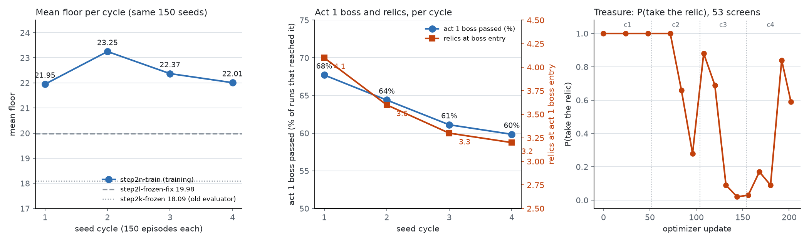
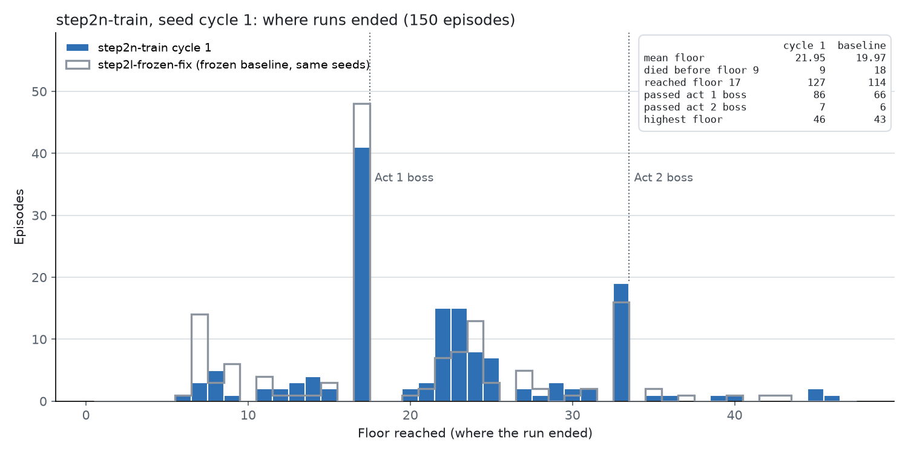
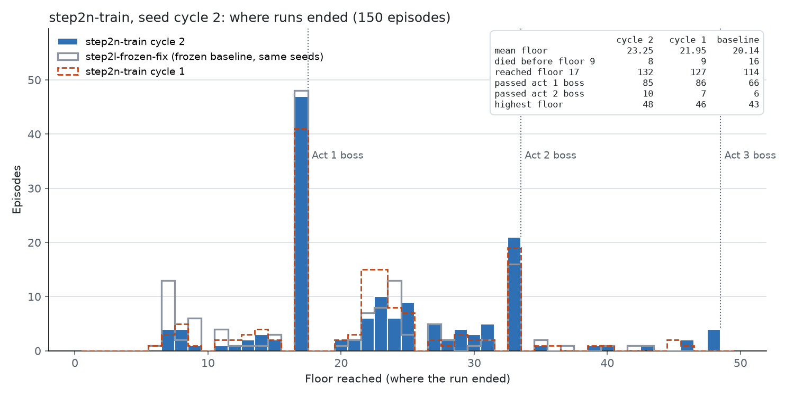
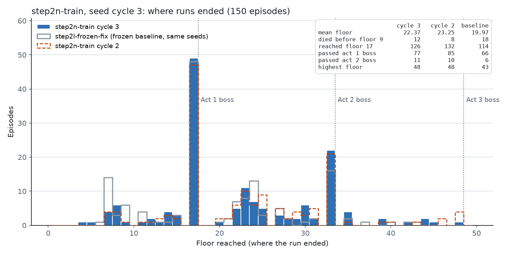
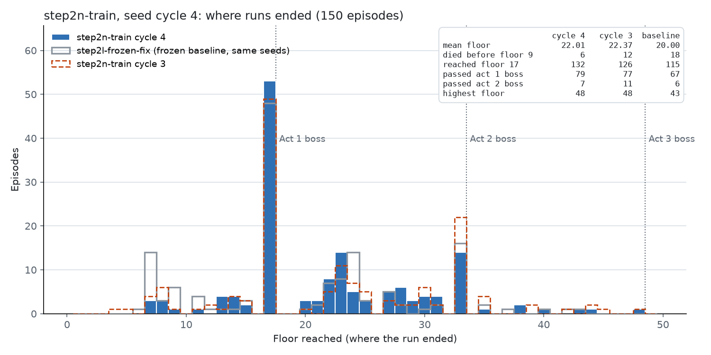

# Step 2-n：修复评估之后的宏观训练（`runs/step2n-train`）

*2026-10-05 20:03 ~ 10-06 07:02，600 局，202 次更新*



## 一句话

带上 Step 2-l 的两个评估修复、boss 战 200 次模拟，从 boss run 的平台期继续训练 600 局：**4 个周期都比冻结基线高 2–3.4 层（p < 0.01–0.12），比旧评估的冻结策略高 4–5 层**；但**第 2 周期之后不再提高**，第 1 幕 boss 的通过率从 68% 降到 60%。原因之一已经找到：**策略在训练中学会了在宝箱房不拿遗物**（P(拿遗物) 从 1.00 降到 0.02），第 1 幕 boss 前的遗物数从 4.1 降到 3.2。没有通关的对局。

## 训练方式

### 整体结构（分层：MCTS 打战斗，PPO 学宏观决策）

- **战斗**（普通怪、精英、boss）全部由 MCTS（ISMCTS）决定，PPO 不参与；战斗步**不进入 rollout**（`--search-fights-out-of-rollout`，Step 2-e），战斗中得到的奖励折叠到战斗前最后一个宏观决策上。
- **宏观决策**（地图路线、选牌、营火、商店、事件、宝箱……）由 `CandidatePPOAgent` 的 actor 决定，每次 PPO 更新的 256 步全是宏观决策。
- 只有一个候选的界面是强制步，不记录（`CLAUDE.md`："Forced steps are folded"）。

### 起点

- `--init-from runs/step2h-boss/checkpoints/update_000192.pt`：boss run（Step 2-h）平台期的整个模型（编码器、actor、critic）和回报缩放（`_ReturnScale`）。
- `--init-optimizer`（Step 2-j，`ef26810`）：同时带上 Adam 的一阶、二阶矩，学习率设为本 run 的值；避免新优化器在前几次更新把策略推走。
- 模型：`hidden_dim 128`，实体 transformer 2 层、4 头、FF 256；带 `act_boss` 特征（Step 2-h）。

### PPO 设置

| 参数 | 值 |
|---|---|
| 学习率 | 3e-4（Adam） |
| rollout | 256 个宏观决策（跨局累积，按 lane 分别做 GAE） |
| minibatch / epoch | 32 / 4（最多 32 个优化步） |
| clip | 0.2 |
| `target_kl` | 0.02：每个优化步之前算 approx KL，超过 0.03（1.5 倍）就停止这次更新（Step 2-e） |
| γ / λ | 0.999 / 0.98 |
| 熵系数 / 价值系数 | 0.01 / 0.5 |
| 梯度裁剪 | 0.5 |
| checkpoint | 每 5 次更新（`update_xxxxxx.pt`） |

### 奖励

`RunProgressReward`：每进入一个节点 +1，每打赢一个 boss +10，每步 −0.01。没有别的项（HP、金币、伤害都不计分）。

### 搜索（MCTS）设置

| 参数 | 值 |
|---|---|
| 树的深度 | 2 个回合（`--search-turn-depth 2`，Step 1-c） |
| 模拟次数 | 普通怪、精英 50；**boss 200**（`--search-boss-simulations 200`，Step 2-i） |
| 隐藏信息 | 每次模拟在根节点 reseed，32 个种子循环使用（common random numbers） |
| 选择 | UCB，探索常数 0.7；progressive widening c = 1.5、α = 0.5 |
| 叶子评估 | `LeafEvaluator`，18 个特征，权重 `search/weights/act1_boss_step1b.json`（Step 1-b 拟合） |
| 评估修复 | Giant 的 Steam Eruption（`70068df`）；按搜索根状态计算敌人剩余 HP、死亡召唤（`71042a9`）；手里不能打出的牌的回合末伤害（`27f52d5`） |

### 环境

- STS2Simulator（`--backend sim`），7 个模拟器（端口 15600–15606），每个模拟器一个 lane。
- 默认 seed 池：150 个训练 seed 循环使用，一个周期 = 150 局，同一个 seed 在每个周期出现一次，所以周期之间可以按 seed 配对比较。
- 代码：`feat/mcts-combat` 的 `0469f18`；CPU 训练。
- 运行：约 11 小时，600 局；截断 2 局，action error 0，reused run 0，训练过程没有报错。

### 命令

```bash
uv run sts2rl-train --run-dir runs/step2n-train --backend sim --base-url http://localhost:15600/api/v1 \
  --ports 15600,15601,15602,15603,15604,15605,15606 --seed-pool default \
  --init-from runs/step2h-boss/checkpoints/update_000192.pt --init-optimizer \
  --search-combat --search-fights-out-of-rollout --search-boss-simulations 200 --target-kl 0.02 \
  --checkpoint-every 5 --total-episodes 600
```

## 结果

### 每个周期

| 周期 | 平均 floor | 最高 | 到第 17 层 | 打过第 1 幕 boss | 打过第 2 幕 boss | 第 9 层前死亡 | 死在第 3 幕 boss | 通关 |
|---|---|---|---|---|---|---|---|---|
| 1 | 21.95 | 46 | 127 | 86/127（68%） | 7 | 9 | 0 | 0 |
| 2 | **23.25** | 48 | 132 | 85/132（64%） | 10 | 8 | 4 | 0 |
| 3 | 22.37 | 48 | 126 | 77/126（61%） | 11 | 12 | 1 | 0 |
| 4 | 22.01 | 48 | 132 | 79/132（60%） | 7 | 6 | 1 | 0 |

死在第 3 幕 boss（第 48 层）的 6 局：`0ZTT4AKVKQ`（第 173 局）、`4LUSRA08AA`（189）、`LY016TGPH9`（241）、`PEX21CB8CY`（261）、`XSNZH9Q4QL`（306）、`H18EBU8G0C`（534）。**没有通关的对局。** 指标里没有胜利字段，通关按奖励判断：打赢的 boss 数 =（奖励 −（floor − 1）+ 0.01 × 步数）/ 10，通关是 3；这 6 局都是 2.0。

### 同一批 seed 的比较

| 比较 | 周期 1 | 周期 2 | 周期 3 | 周期 4 |
|---|---|---|---|---|
| 对 `step2l-frozen-fix`（同起点、冻结、只有击杀修复） | +2.05（p = 0.009） | **+3.35**（p = 0.004） | +2.27（p = 0.12，t = 2.6） | +1.97（p = 0.02） |
| 对 `step2k-frozen`（同起点、冻结、旧评估） | +4.01 | **+5.23** | +4.31 | +3.97 |
| 对上一个周期 | — | +0.95（p = 0.29） | −1.21（p = 0.43） | −0.40（p = 0.39） |

p 是符号检验。

- 第 1 周期的 +2 层里，训练只是一部分：同一个周期里还有 boss 战 200 次模拟和 Infection 修复，没有单独测量（按指示直接训练）。
- **训练本身只在第 1 → 2 周期带来了提高（+0.95，不显著），之后两个周期都没有再提高。**

### floor 分布

| 周期 1 | 周期 2 |
|---|---|
|  |  |
| **周期 3** | **周期 4** |
|  |  |

- 第 9 层之前的死亡比冻结基线少了一半（基线 18 局，各周期 6–12 局）。
- 第 1 幕 boss（第 17 层）始终是最大的峰（41–49 局结束在这里）。
- 打过第 1 幕之后，大部分 run 结束在第 21–25 层（第 2 幕前半段）和第 33 层（第 2 幕 boss）。

### 战斗（按周期）

| 战斗 | 周期 1 | 周期 2 | 周期 3 | 周期 4 |
|---|---|---|---|---|
| 第 1 幕 boss（全部） | 87/127 | 87/133 | 76/125 | 74/127 |
| Ceremonial Beast | 15/19 | 19/21 | 17/21 | 15/22 |
| The Kin | 19/27 | 16/27 | 14/26 | **11/24** |
| Lagavulin Matriarch | 10/22 | 14/24 | 12/22 | 13/23 |
| Soul Fysh | 22/26 | 22/26 | 16/24 | 20/25 |
| Vantom | 10/14 | 10/14 | 10/14 | 6/13 |
| Waterfall Giant | 11/19 | 6/21 | 7/18 | 9/20 |
| Phrog Parasite | 22/24 | 17/19 | 18/23 | 11/15 |
| 第 1 幕精英（死亡率） | 8% | 11% | 13% | 13% |
| 第 1 幕普通战斗（死亡率） | 1% | 1% | 1% | 1% |
| 第 2 幕 boss | 7/27 | 10/30 | 5/28 | 4/16 |
| 第 2 幕精英（死亡率） | 31% | 42% | 29% | 33% |

战斗按 run id 第一次出现的顺序分到周期（战斗记录没有 seed），周期边界可能差几局。

- 第 1 幕 boss 进入时的 HP 一直是 87–90%，掉的 HP、回合数也没有变化；变差的是 Kin（70% → 46%）和 Vantom。
- 普通战斗基本不再死人（1%），Phrog Parasite 从 Step 2-l 之前的 77% 死亡率降到 8–27%。
- 第 2 幕 boss 只赢 20–33%，是下一道墙。

### 为什么第 1 幕 boss 越打越差：宝箱里的遗物

第 1 幕 boss 进入时的状态（平均）：

| 周期 | HP | 牌组 | 基础牌 | 升级 | 药水 | **遗物** | 金币 | 金币 ≥ 150 |
|---|---|---|---|---|---|---|---|---|
| 1 | 90% | 20.0 | 8.6 | 0.7 | 0.82 | **4.1** | 138 | 49/127 |
| 2 | 89% | 19.1 | 8.4 | 0.6 | 0.65 | **3.6** | 152 | 59/133 |
| 3 | 87% | 18.5 | 8.4 | 0.6 | 0.65 | **3.3** | 156 | 55/125 |
| 4 | 87% | 18.7 | 8.6 | 0.6 | 0.63 | **3.2** | 148 | 55/127 |

遗物每个周期都在减少。在 100 个人类录像里的 53 个宝箱界面上测各个 checkpoint 拿遗物的概率：

| checkpoint | 起点 | 24 | 48 | 72 | 84 | 96 | 108 | 120 | 132 | 144 | 156 | 168 | 180 | 192 | 202 |
|---|---|---|---|---|---|---|---|---|---|---|---|---|---|---|---|
| P(拿遗物) | 1.00 | 1.00 | 1.00 | 1.00 | 0.66 | 0.28 | 0.88 | 0.69 | 0.09 | **0.02** | 0.03 | 0.17 | 0.09 | 0.84 | 0.59 |

**第 72 次更新之后，策略学会了离开宝箱而不拿遗物**，第 132–180 次更新几乎从不拿。这就是 `CLAUDE.md` 里已经记下的问题：`_treasure_actions` 把 `claim_treasure_relic` 和 `proceed` 一起提供，`proceed` 少走一步（省 0.01），而遗物的价值要很久以后才体现，噪声很大，PPO 会滑向"直接离开"——和以前奖励界面上 27/28 次选 `proceed` 是同一个陷阱。同时商店和选牌的选择没有变化（P(离开商店) = 0，P(跳过选牌) = 0）。

### 训练指标（按周期）

| 周期 | 更新 | 每次更新的优化步（中位数） | 停止时 KL（中位数） | value loss（平均 / 最高） | 熵 | 梯度范数（中位数） | 回报缩放 |
|---|---|---|---|---|---|---|---|
| 1 | 52 | 6 | 0.089 | 0.17 / 0.54 | 0.51 | 1.51 | 12.27 |
| 2 | 52 | 6 | 0.061 | 0.13 / 0.53 | 0.49 | 1.34 | 12.52 |
| 3 | 50 | 8 | 0.076 | 0.10 / 0.28 | 0.49 | 1.03 | 12.62 |
| 4 | 48 | 8 | 0.053 | 0.08 / 0.24 | 0.57 | 0.74 | 12.68 |

- 训练稳定：value loss 一直很低，没有 critic 崩溃；每次更新都因为 KL 上限在 6–8 步停止。
- 回报缩放从第 2 周期开始几乎不变（12.5 → 12.7），和 floor 不再上升一致。

## 结论

1. 评估修复 + boss 200 次模拟 + 继续训练，把同一批 seed 的平均 floor 从 18.1（旧评估）提高到 22–23.3；最高到第 48 层（第 3 幕 boss），没有通关。
2. **训练在第 2 周期之后不再提高**，其中一个明确的原因是宝箱房不拿遗物：遗物减少，第 1 幕 boss 通过率从 68% 降到 60%。
3. 剩下的墙：第 1 幕 boss（约 40% 的 run 结束在这里，尤其是 The Kin）和第 2 幕 boss（只赢 20–33%）。牌组仍然没有改善：升级 0.6 张、药水 0.6 瓶、40% 的 boss 战带着 150 以上没花的金币。

## 下一步

1. **修复宝箱**：像奖励界面一样，`claim_treasure_relic` 单独提供（强制步，不进 policy gradient），拿完之后才提供 `proceed`。先在模拟器里确认拿走之后遗物会从宝箱里消失（`CLAUDE.md` 要求的检查），否则不提供 `proceed` 会卡住。
2. 修复之后从本 run 的 checkpoint（宝箱概率还高的 `update_000072` 或最后的 `update_000202`）继续训练，基线用同一个 checkpoint 的冻结 run。
3. 牌组构筑（升级、药水、金币）仍是主要瓶颈；人类录像的行为克隆加 KL 约束（之前的提案 C）仍然是候选。
