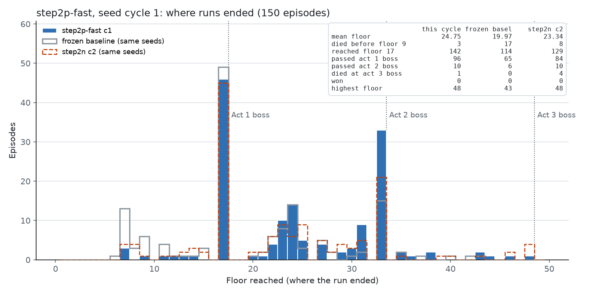
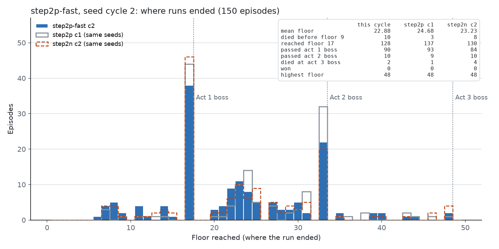
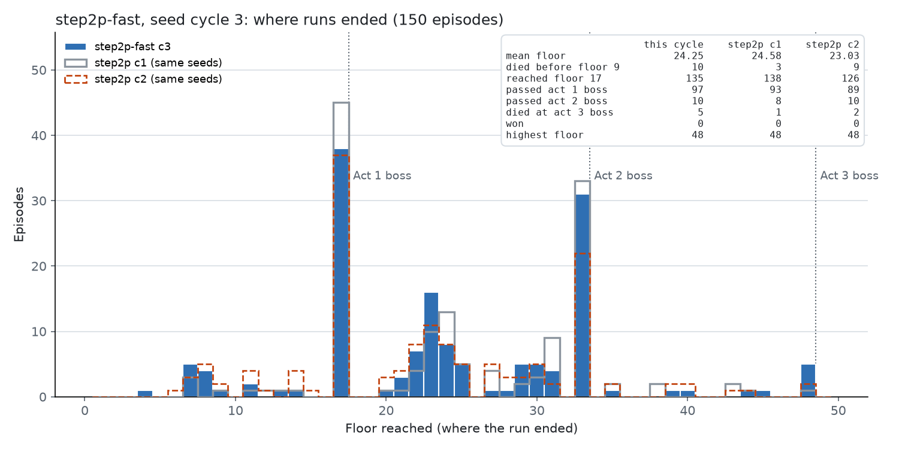

# Step 2-p：修复奖励归属之后，从最好的周期继续训练（`runs/step2p-fast`）

*2026-10-06 15:06 ~ 20:11，450 局，164 次更新*

## 一句话

从 Step 2-n 最好的周期（第 2 周期）继续训练 3 个周期，带上宝箱修复和奖励归属修复：

- **第 1 周期平均 24.75 层，是目前所有 run 中最高的周期。** 它比 Step 2-n 第 2 周期高 1.24 层（p = 0.10，不显著），比冻结基线高 4.8 层（p < 0.0001）。
- **第 2 周期降到 22.88 层**，比第 1 周期低（同 seed 配对，p = 0.035）。第 3 周期回到 24.25 层。
- 和 Step 2-n 一样，**继续训练没有让策略持续提高**。
- 到达第 3 幕 boss 8 局，**通关 0 局**。
- 训练吞吐量约 **88 局/小时**，Step 2-n 约 55 局/小时。

## 训练方式

整体结构、PPO 设置、奖励、MCTS 设置都和 Step 2-n 相同（见 [step2n-training.md](step2n-training.md)）。下面只列出不同的地方，再给出完整命令。

### 起点

- `--init-from runs/step2n-train/checkpoints/update_000102.pt`：Step 2-n 第 2 周期的最后一个 checkpoint。第 2 周期是 Step 2-n 最好的周期（23.25 层）。
- `--init-optimizer`：同时带上 Adam 的状态。

### 和 Step 2-n 相比的修改

| 修改 | 提交 | 记录 |
|---|---|---|
| 宝箱：先拿遗物（强制步），拿完才能离开 | `fd4e3c4` | [step2o-treasure.md](step2o-treasure.md) |
| 奖励归属：PPO 更新只训练已完成的决策；每个 lane 最后一个未完成的决策留到下一次更新 | `e0387f2` | [step2p-held-steps.md](step2p-held-steps.md) |
| HTTP 客户端改用 urllib3；`restore` 和 `reseed` 合并成一个请求 | `d43fcfc`、`55f36c0`、`6e112af`，模拟器 `785bf21` | [step2p-perf.md](step2p-perf.md) |
| 模拟器从 7 个增加到 10 个（端口 15600–15609） | — | — |

### 完整命令

驱动脚本 `runs/step2p_fast_driver.sh`，代码 `feat/mcts-combat` 的 `6e112af`，CPU 训练：

```bash
uv run sts2rl-train --run-dir runs/step2p-fast --backend sim --base-url http://localhost:15600/api/v1 \
  --ports 15600,15601,15602,15603,15604,15605,15606,15607,15608,15609 --seed-pool default \
  --init-from runs/step2n-train/checkpoints/update_000102.pt --init-optimizer \
  --search-combat --search-fights-out-of-rollout --search-boss-simulations 200 --target-kl 0.02 \
  --checkpoint-every 5 --total-episodes 450
```

| 项目 | 值 |
|---|---|
| PPO | lr 3e-4，rollout 256，minibatch 32，4 epoch，clip 0.2，γ 0.999，λ 0.98，熵系数 0.01，价值系数 0.5，梯度裁剪 0.5 |
| KL 早停 | `target_kl` 0.02，approx KL 超过 0.03 停止 |
| 奖励 | 每进入一个节点 +1，每个 boss +10，每步 −0.01 |
| MCTS | 深度 2 个回合；普通怪、精英 50 次模拟，boss 200 次；32 个种子循环 reseed；UCB c = 0.7 |
| 叶子评估 | 18 个特征，`act1_boss_step1b.json`，带 Step 2-l 的两个修复 |
| seed | 默认池，150 个训练 seed；一个周期 = 150 局 |

### 运行记录

- 第一次启动 `runs/step2p-train`（13:28，`e0387f2`，10 个模拟器）在 63 局时随会话重启停止。所有训练和模拟器进程都退出了，日志中没有 exit 行。这 63 局不计入结果。
- 15:06 用同样的起点、加上性能优化，重新开始 `runs/step2p-fast`。20:11 正常结束（exit 0）。
- 450 局，5 小时 5 分钟，约 **88 局/小时**。Step 2-n（7 个模拟器，旧客户端）约 55 局/小时。
- 截断 2 局，都是商店里的 Foul Potion 被拒绝后重复同一动作（第 1、2 周期各 1 局）。这个问题之后已修复，见 [step2q-foul-potion.md](step2q-foul-potion.md)。action error 0，reused run 0。

## 结果

### 每个周期

| 周期 | 平均楼层 | 到达第 17 层 | 过第 1 幕 boss | 过第 2 幕 boss | 第 9 层前死亡 | 第 3 幕 boss 死亡 | 通关 |
|---|---|---|---|---|---|---|---|
| 1 | **24.75** | 142 | 96 / 142 | 10 | 3 | 1 | 0 |
| 2 | 22.88 | 128 | 90 / 128 | 10 | 10 | 2 | 0 |
| 3 | 24.25 | 135 | 97 / 135 | 10 | 10 | 5 | 0 |

对照（Step 2-n 的 4 个周期）：21.95、**23.25**、22.37、22.01。

第 3 幕 boss（第 48 层）死亡的 seed：

- 第 1 周期：BE373Z71WC（第 66 局）
- 第 2 周期：XPTWPYU48C（166）、JEQSXL4XVT（242）
- 第 3 周期：3PANEGKLP8（329）、6S8W3SPCTK（346）、PEX21CB8CY（411）、R0QAH22FT7（422）、V1WJ9EMZ3B（429）

### 楼层分布







### 同 seed 配对比较

每个 seed 取该周期的第一局，符号检验：

| 比较 | 共同 seed | 平均楼层 | 差 | 更高 / 更低 | p |
|---|---|---|---|---|---|
| c1 对 Step 2-n c2 | 143 | 23.59 → 24.83 | +1.24 | 63 / 45 | 0.10 |
| c2 对 Step 2-n c2 | 145 | 23.43 → 22.87 | −0.56 | 59 / 55 | 0.78 |
| c3 对 Step 2-n c2 | 143 | 23.48 → 24.42 | +0.94 | 62 / 44 | 0.10 |
| c1 对冻结基线（Step 2-l 修复后） | 147 | 19.97 → 24.78 | +4.82 | 79 / 30 | < 0.0001 |
| c2 对冻结基线 | 147 | 20.06 → 22.84 | +2.78 | 71 / 46 | 0.026 |
| c3 对冻结基线 | 147 | 19.88 → 24.24 | +4.36 | 78 / 44 | 0.003 |
| c2 对 c1 | 144 | 24.74 → 22.52 | −2.22 | 43 / 66 | 0.035 |
| c3 对 c2 | 144 | 22.99 → 24.28 | +1.29 | 59 / 55 | 0.78 |

冻结基线是 `runs/step2l-frozen-fix`：Step 2-h 的平台期 checkpoint，学习率 1e-12，带 Step 2-l 的评估修复。

### 按战斗类型

胜场 / 场数（死亡率），进入时 HP 比例，损失的 HP，回合数：

| 战斗 | c1 | c2 | c3 |
|---|---|---|---|
| 第 1 幕 boss（全部） | 98/142（31%），91%，51.5，9.1 | 88/129（32%），88%，51.3，8.8 | 93/126（26%），94%，54.7，9.0 |
| Ceremonial Beast | 18/23（22%） | 17/21（19%） | 19/20（5%） |
| Kin Priest | 17/28（39%） | 16/21（24%） | 19/26（27%） |
| Lagavulin Matriarch | 17/24（29%） | 14/23（39%） | 16/21（24%） |
| Soul Fysh | 26/30（13%） | 24/28（14%） | 24/26（8%） |
| Vantom | 11/16（31%） | 7/14（50%） | 8/15（47%） |
| Waterfall Giant | 9/21（57%） | 10/22（55%） | 7/18（61%） |
| 第 1 幕精英 | 101/106（5%） | 111/120（7%） | 88/98（10%） |
| 第 1 幕普通怪 | 960/963（0%） | 910/922（1%） | 920/926（1%） |
| 第 2 幕精英 | 31/47（34%） | 26/32（19%） | 27/38（29%） |
| 第 2 幕普通怪 | 443/481（8%） | 345/397（13%） | 388/431（10%） |
| **第 2 幕 boss** | **9/43（79%）** | **7/27（74%）** | **9/38（76%）** |

注：这里的场数按搜索记录计算，不包括每个 lane 最后一局未完成的对局，所以和上一张表略有差别。

- **第 2 幕 boss 是现在的主要瓶颈。** 死亡率 74–79%，进入时 HP 83–85%。
- 第 1 幕 boss 中，Waterfall Giant 仍然最难（死亡率 55–61%）。
- 第 1 幕的精英和普通怪几乎不造成死亡。

### 进入第 1 幕 boss 时的状态（平均）

| 周期 | HP | 牌组 | 升级牌 | 药水 | 遗物 | 金币 | 金币 ≥ 150 |
|---|---|---|---|---|---|---|---|
| 1 | 91% | 20.6 | 0.66 | 0.64 | 4.12 | 155 | 63 / 142 |
| 2 | 88% | 19.2 | 0.74 | 0.58 | 4.28 | 169 | 64 / 129 |
| 3 | 94% | 18.4 | 0.83 | 0.76 | 4.17 | 156 | 61 / 126 |

- 宝箱修复有效：遗物数回到约 4.2（Step 2-n 后期降到 3.2）。
- 升级牌仍然少于 1 张，营火几乎总是休息。44–50% 的 boss 战带着 150 以上没花的金币。这两点和 Step 2-n 相同，这次训练没有改变它们。

### 训练指标

| 周期 | 更新次数 | 每次更新的优化步（中位数） | 停止时的 KL（中位数） | 价值损失（平均 / 最大） | 熵 | 梯度范数（中位数） | 回报缩放（周期末） |
|---|---|---|---|---|---|---|---|
| 1 | 59 | 7 | 0.068 | 0.08 / 0.35 | 0.550 | 1.09 | 12.83 |
| 2 | 51 | 11 | 0.062 | 0.08 / 0.27 | 0.575 | 0.84 | 13.03 |
| 3 | 54 | 10 | 0.061 | 0.11 / 0.67 | 0.626 | 0.78 | 13.34 |

- 每次更新平均保留 9.95 个未完成的决策（10 个 lane，每个最多 1 个）。这是 `e0387f2` 的预期行为。
- 熵从 0.55 升到 0.63。价值损失在第 3 周期升高（最大 0.67，最后 10 次平均 0.21）。
- 回报缩放从 12.8 升到 13.3，和平均楼层的变化一致。

## 结论

1. **起点比训练更重要。** 最好的周期是第 1 周期，它离起点最近。Step 2-n 也是这样：最好的是第 2 周期，之后下降。
2. **奖励归属修复和宝箱修复没有带来持续上升。** 第 1 周期比 Step 2-n 最好的周期高 1.24 层，但 p = 0.10，不能确定。
3. **周期之间的波动约 2 层。** 第 2 周期比第 1 周期低 2.2 层（p = 0.035），第 3 周期又回升。只看一个周期不能判断训练的方向。
4. **宏观策略没有学会构筑牌组。** 升级牌、药水、金币的使用都没有变化。PPO 的信号（每层 +1）对这类延迟价值太弱。
5. **第 2 幕 boss 是新的瓶颈。** 进入时 HP 足够，死亡率仍在 75% 左右，原因可能是牌组强度不够，而不是搜索。

## 下一步（建议）

- 用冻结策略，在同一批 seed 上评估几个 step2p-fast 的 checkpoint（例如第 1 周期末的 `update_000060`、第 2 周期末的 `update_000108`、最后的 `update_000164`），选出最好的起点。
- 分析第 2 幕 boss 的战斗：按 boss 分类，并比较进入时的牌组。
- 牌组构筑（升级、商店）需要更强的信号，例如蒸馏人类录像中的宏观决策，或者对营火、商店做专门的 A/B。
