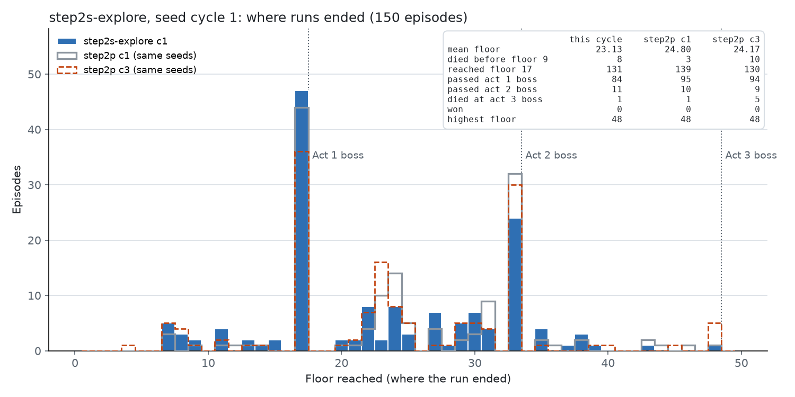
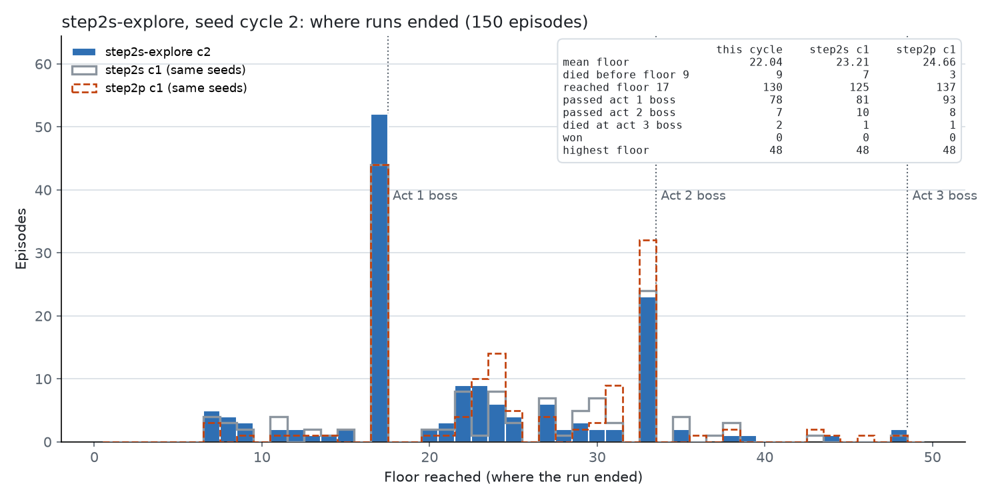
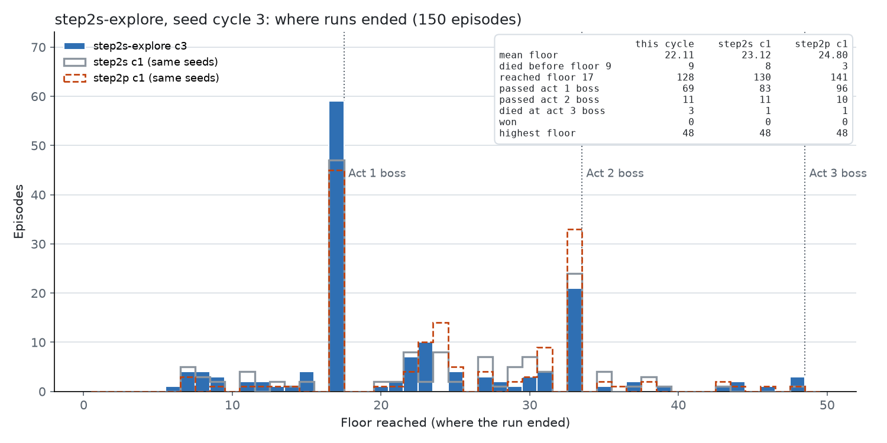

# Step 2-s：定向探索（`runs/step2s-explore`）

*2026-10-06 23:36 ~ 10-07 04:28，450 局，153 次更新*

## 一句话

在营火、选牌奖励、地图界面上加 ε 探索（0.3 / 0.3 / 0.15），从 holdout 上最好的 checkpoint（Step 2-p 的 `update_000060`）继续训练 3 个周期。**探索没有恢复塌缩的选项**：153 次更新后，营火升级的概率仍是 0.01（人类 0.65），跳过选牌仍是 0.00（人类 0.52）。策略的变化发生在别处（商店买什么、选哪张牌），而且没有带来提高：训练池上比 Step 2-p 低 1.9 层（p = 0.005，含探索噪声）；holdout 上第 1 周期末比起点低 3.0 层，第 3 周期末回到起点附近（−0.1）。这是一个明确的否定结果：**只给样本不够，这两个选项的优势平均不是正的，PPO 会把探索到的概率压回去。** 下一步是向人类克隆策略的 KL 约束（Step 2-t）。

## 训练方式

### 探索机制（`85c6703`）

- `PPOConfig.exploration`：每种界面一个 ε。训练时，在有 ε 的界面上，如果候选多于一个，就从混合分布 μ(a) = (1−ε)·π(a) + ε/N 中采样：以概率 ε 均匀随机选一个候选，否则按策略采样。
- **混合分布是被训练的策略**（Codex 审查后的设计）：记录的 log probability 是 μ_old(a)，更新时的比率是 μ_new / μ_old，裁剪和 KL 早停都作用在这个比率上。所以每次更新从比率 1 开始，和没有探索时一样。μ 的对数在 log 空间计算，避免 π(a) 下溢。
- 另外记录 π_old(a)，用于监控指标 `policy_kl`：按 π_old/μ_old 加权的 KL(π_old ‖ π_new)。它衡量策略自己移动了多少；KL 早停看不见这部分。
- 评估（`sts2rl-eval`）不探索，取 argmax。
- ε 为 0 的界面和原来的采样路径逐字节相同（测试用基准提交的黄金值验证）。全部 862 个测试通过。
- 新指标：`explored_steps`、`explore/<界面>`、`explored_positive_advantage`（探索步中归一化优势为正的比例）、`policy_kl`。
- 设计审查：`runs/codex/exploration_design.md` → `.out`；diff 审查：`runs/codex/exploration_diff_review.md` → `.out`。审查要求的修改（混合分布作为训练策略、`policy_kl` 的数值稳定、ε/N 下溢、测试）都已落实。

### 起点和设置

- `--init-from runs/step2p-fast/checkpoints/update_000060.pt --init-optimizer`：holdout 上最好的 checkpoint（见 [step2r-holdout-eval.md](step2r-holdout-eval.md)）。
- `--explore rest_site=0.3,card_reward=0.3,map=0.15`。地图的 ε 低一些，因为随机走路线会直接损失楼层。
- 其他和 Step 2-p 相同：10 个模拟器（15600–15609），MCTS 50 / boss 200，`target_kl` 0.02，lr 3e-4，rollout 256，每 5 次更新一个 checkpoint，默认 seed 池，`--holdout-seeds default`（这次 checkpoint 记录了 holdout seed）。
- 代码 `feat/mcts-combat` 的 `85c6703`；驱动脚本 `runs/step2s_driver.sh`。
- 4 小时 51 分钟，450 局，约 93 局/小时。0 错误，0 截断。

### 评估方式

- 每个周期末的 checkpoint 在 30 个 holdout seed 上评估（每个 seed 3 局，argmax，MCTS 50 / boss 200），和 Step 2-r 的四个 checkpoint 比较。周期 1：`update_000054`；周期 2：`update_000102`；周期 3：`update_000153`（最后）。
- `scripts/policy_probe.py` 在人类录像的 1317 个宏观界面上探测每个周期末的动作概率。

## 结果

### 每个周期（训练中，含探索噪声）

| 周期 | 平均楼层 | 到第 17 层 | 过第 1 幕 boss | 过第 2 幕 boss | 第 3 幕 boss 死亡 | 第 9 层前死亡 |
|---|---|---|---|---|---|---|
| 1 | 23.13 | 131 | 84 / 131 | 11 | 1 | 8 |
| 2 | 22.04 | 130 | 78 / 130 | 7 | 2 | 9 |
| 3 | 22.11 | 128 | 69 / 128 | 11 | 3 | 9 |

第 3 幕 boss 死亡的 seed：FHHFSB5W4C（第 79 局）、H14T0C5F9B（237）、PEX21CB8CY（279）、EU058TPXR2（383）、NYBVL26E3R（421）、YM58Q1TE7Z（450）。通关 0。

同 seed 比较（每个 seed 取 Step 2-p 三个周期的平均作对照）：

| 周期 | Step 2-p | 本次 | 差 | 更高 / 更低 | p |
|---|---|---|---|---|---|
| 1 | 23.97 | 23.33 | −0.64 | 65 / 73 | 0.55 |
| 2 | 23.91 | 22.08 | −1.83 | 57 / 80 | 0.060 |
| 3 | 24.00 | 22.15 | −1.85 | 53 / 87 | **0.005** |

训练时 30% 的营火和选牌、15% 的地图决策是随机的，所以这些楼层含探索的损失，不能直接当作策略的水平。策略本身看下面的 holdout。

### holdout 评估（argmax，不探索）

| checkpoint | 局数 | 平均楼层 | 对 p060（同 30 seed） | 更高 / 更低 / 相同 | p |
|---|---|---|---|---|---|
| p060（起点，Step 2-r） | 90 | 26.30 | — | — | — |
| 周期 1 末 `update_000054` | 79 | 22.78 | 25.86 → 22.83，**−3.03** | 8 / 16 / 6 | 0.15 |
| 周期 2 末 `update_000102` | 90 | 24.09 | 25.86 → 24.09，−1.77 | 9 / 13 / 8 | 0.52 |
| 周期 3 末 `update_000153` | 90 | 25.78 | 25.86 → 25.78，−0.08 | 10 / 16 / 4 | 0.33 |

周期 1 的评估在 79 局时崩溃：模拟器在一个水晶球事件后报 "The run faulted … The game settled mid-combat outside the player's turn"，`sim/restore` 返回 409，同一 lane 连续 3 次失败后评估按设计退出。30 个 seed 每个都有 2–3 局，配对比较仍然有效。周期 2、3 的评估在训练结束后进行（周期 3 用 6 个模拟器）。

去掉探索噪声之后的曲线：周期 1 末比起点低 3.0 层，周期 2 末低 1.8 层，周期 3 末回到起点附近（−0.1，但 30 个 seed 里 16 个更低、10 个更高）。周期 3 末对 p164 高 3.5 层（20 高 / 8 低，p = 0.036），也就是说它和 Step 2-p 的 p108 一个水平（+0.36，p = 1.0）。**三个周期没有带来任何提高。**

### 探测：塌缩的选项没有恢复

| 界面 | 选项 | 人类 | p060 | 周期 1 末 | 周期 2 末 | 周期 3 末 |
|---|---|---|---|---|---|---|
| 营火 | 升级（SMITH） | 0.65 | 0.01 | 0.02 | 0.00 | **0.01** |
| 营火 | 休息，HP > 80% | 0.06 | 0.83 | 0.84 | 0.82 | 0.83 |
| 选牌奖励 | 跳过 | 0.52 | 0.00 | 0.00 | 0.00 | **0.00** |
| 地图 | 精英（提供时） | — | 0.06 | 0.01 | 0.05 | 0.02 |

探索给了样本：每次更新平均 15 步探索步（营火 3.3、选牌 8.9、地图 3.0），三个周期合计约 500 次营火探索（约一半是升级）和 1350 次选牌探索（约四分之一是跳过）。这些样本的归一化优势为正的比例是 0.46–0.55，和随机没有差别。策略在这两个选项上没有移动。

### 探测：策略移动去了哪里

| 界面 | 选项 | 人类 | p060 | 周期 1 末 | 周期 2 末 | 周期 3 末 |
|---|---|---|---|---|---|---|
| 商店 | 买牌 | 0.22 | 0.92 | 0.39 | 0.19 | 0.05 |
| 商店 | 买药水 | 0.04 | 0.08 | 0.46 | 0.67 | 0.67 |
| 商店 | 丢弃药水 | 0.00 | 0.07 | 0.24 | 0.34 | **0.75** |
| 商店 | 和 p060 的 argmax 一致率 | — | 1.00 | 0.40 | 0.14 | 0.05 |
| 选牌奖励 | 和 p060 的 argmax 一致率 | — | 1.00 | 0.49 | 0.54 | 0.82 |
| 地图 | 休息点（提供时） | — | 0.88 | 0.97 | 0.95 | 0.96 |

商店没有探索，但变化最大：从"买牌"变成"买药水、丢药水"。这个变化和训练中 policy_kl 的尖峰一致（中位数 0.06–0.08，个别更新 0.3–0.46，而混合 KL 只有 0.03–0.1）：策略在它自己的空间里移动得比 KL 早停看到的多。

### 按战斗类型

| 战斗 | 周期 1 | 周期 2 | 周期 3 | Step 2-p |
|---|---|---|---|---|
| 第 1 幕 boss 死亡率 | 35% | 40% | 47% | 26–32% |
| 第 1 幕精英死亡率 | 10% | 15% | 11% | 5–10% |
| 第 2 幕 boss 死亡率 | 81% | 81% | 68% | 74–79% |

进入第 1 幕 boss 时：HP 86–88%，牌组 19.3 / 18.7 / 18.0 张，升级牌 1.00 / 0.90 / 1.18（Step 2-p 0.66–0.83；多出来的大约是探索随机选到的升级），药水 0.7–0.8，遗物 4.1，金币约 155。

### 训练指标

| 周期 | 更新 | 每次探索步 | 正优势比例 | 混合 KL（停止时中位数） | policy_kl 中位数 | 优化步中位数 | 熵 | 价值损失（均 / 最高） | 回报缩放 |
|---|---|---|---|---|---|---|---|---|---|
| 1 | 55 | 15.7 | 0.51 | 0.047 | 0.062 | 11 | 0.51 | 0.09 / 0.48 | 13.06 |
| 2 | 49 | 15.2 | 0.55 | 0.058 | 0.068 | 9 | 0.56 | 0.10 / 0.41 | 13.26 |
| 3 | 49 | 14.3 | 0.46 | 0.052 | 0.082 | 9 | 0.52 | 0.08 / 0.47 | 13.39 |

训练过程稳定，没有 critic 崩溃。

## 结论

1. **定向探索没有恢复升级和跳过。** 约 250 次升级样本和 340 次跳过样本之后，两个选项的概率仍然是 0。
2. **原因是信用分配，不是采样。** 探索步的正优势比例约 0.5，升级和跳过的样本平均没有正优势：critic 认为休息和拿牌更好（和之前 PBRS 的离线检验一致），PPO 就把概率压回去。Codex 在设计审查时预测了这个失败模式。
3. **探索没有带来提高，前两个周期还让策略变差。** 训练池上比 Step 2-p 低 1.9 层（p = 0.005，含探索噪声）；holdout 上周期 1 末比起点低 3.0 层，周期 3 末回到起点附近（−0.1）。商店策略漂移到买药水、丢药水。
4. 一个工程结论：`target_kl` 只约束采样动作上的 KL；混合采样时，策略在低概率动作上可以在一次更新里移动很多（policy_kl 尖峰到 0.46）。

## 下一步

- **Step 2-t：向人类克隆策略的 KL 约束**（`feat/bc-kl`，已合并，`0c68d21`）。它的梯度 β(π_θ − π_ref) 不依赖采样，参考分布有概率的选项就有梯度。从 p060 开始，β = 0.1，不探索。
- 探索的代码保留（默认关闭）；以后如果有了能给升级正优势的 critic，可以再试。
