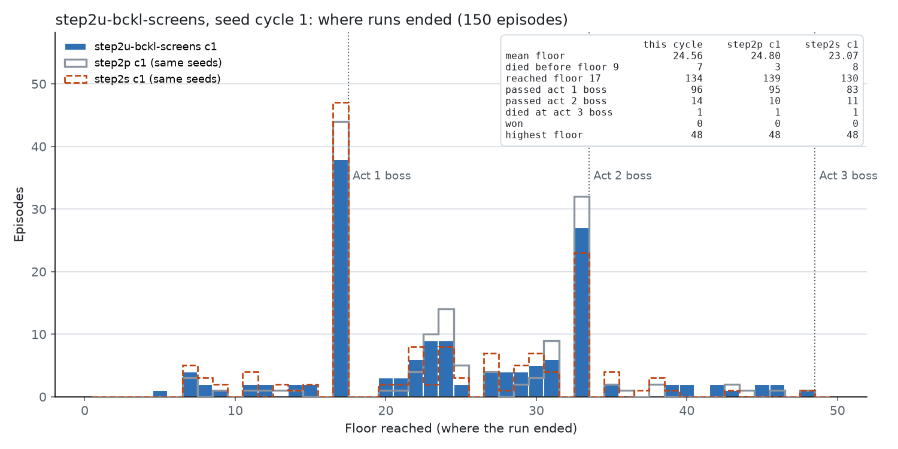
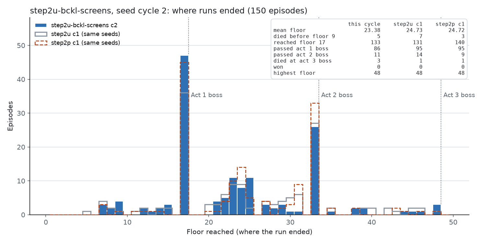
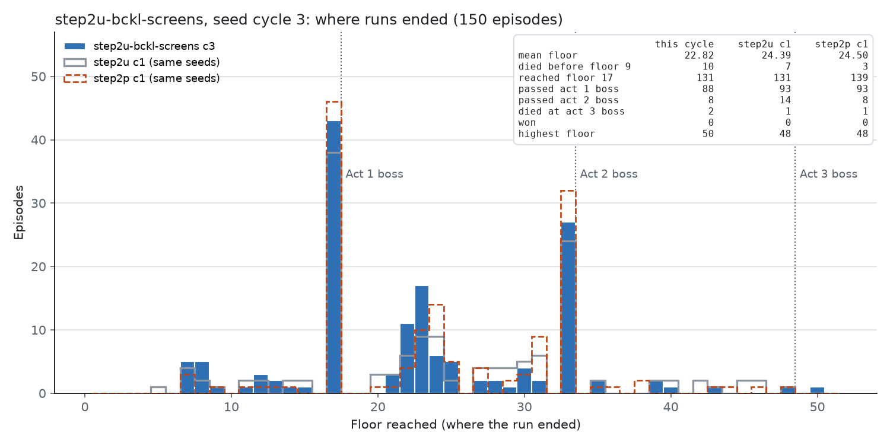

# Step 2-t / 2-u：向人类克隆策略的 KL 约束（`runs/step2t-bckl`、`runs/step2u-bckl-screens`）

*2026-10-07 05:38 ~ 12:09*

## 一句话

在 PPO 的损失里加一项 β·KL(π_ref ‖ π_θ)，π_ref 是用 17 局人类录像克隆出的参考策略。它的梯度 β(π_θ − π_ref) 不依赖采样，所以能直接把塌缩到 0 的选项拉起来——探索（Step 2-s）做不到这一点。

- **Step 2-t（全局 β = 0.1，1 个周期后停）**：升级概率 0.01 → 0.18，但参考模型在选牌（准确率 65%）和商店（40%）上不可靠，它的"不确定"被当作先验复制过来，选牌的熵翻了三倍，楼层掉了 7 层（holdout 对起点 −6.0，p = 0.002）。
- **Step 2-u（按界面的 β：营火 0.1、地图 0.03，其他 0；3 个周期）**：升级概率 0.01 → 0.20–0.27，进入第 1 幕 boss 时的升级牌 0.7 → 1.3 张，选牌和商店不受影响。楼层和起点持平：训练池上对 Step 2-p −0.3（p = 0.6），holdout 周期 1 末对 p060 −1.0（p = 0.8）。**行为改变了，楼层没有变**；升级概率在 0.26 附近停住，β = 0.1 的拉力和 critic 对休息的偏好达到平衡。通关 0。

## 机制（`b1f6a29`、`0c68d21`、`d1d2622`、`7a5db25`）

- **参考策略**：`sts2rl-bc-train` 在 data/bc/v7 全部 10771 个决策上训练（`runs/bc-v7`，04:29 ~ 05:05，选第 4 个 epoch，留出交叉熵 1.117，准确率 56.4%：营火 76.5%、选牌 65%、地图 75.5%、商店 40%）。它在人类界面上的分布：升级 0.68，休息 0.34（不随 HP 变化——它没学到这一点），跳过选牌 0.62，商店主动离开 0.27，精英（提供时）0.28。
- **损失项**：`loss += β · mean_{策略步} KL(π_ref(·|s) ‖ π_θ(·|s))`。不乘优势、不乘比率、不进优势归一化；强制步和外部步（搜索打的战斗）不计入。采样时在同一个候选集合（`exclude` 之后）上算 `log_softmax` 并存下；更新时重新编码后计算 KL。用前向 KL 是因为它是 mode-covering：参考分布有概率的地方，策略必须也有概率；反向 KL 在 π_θ(a) = 0 处的惩罚是有限的，拉不起来。
- **参考模型**：独立参数，冻结、eval、不进 Adam；拒绝和 actor 共享存储；参考权重复制进 run 目录（`reference_policy.pt`）并记 sha256，哈希和加载读同一份字节；resume 校验哈希，拒绝改 β、参考或映射。评估不需要参考模型。
- **按界面的 β**（`--reference-kl-screens rest_site=0.1,map=0.03`）：没写的界面系数为 0，不做参考前向、不拉。损失为 Σ β_s·KL_s / N_策略步。每个界面单独记 `reference_kl/<界面>` 和 `reference_steps/<界面>`（按整个更新汇总，没样本时不输出）。
- **数值保护**：最终损失非有限时在反向传播前报错；梯度范数非有限时报错（`error_if_nonfinite`）。β = 0 时和旧代码逐位相同（用基准提交的黄金值固定，含非零探索的情形）。
- 设计和 diff 都经 Codex 审查两轮（`runs/codex/bc_kl_design.*`、`bckl_diff_review.*`、`bckl_screens_review.*`）。测试 862 → 918 → 951。

## Step 2-t：全局 β = 0.1（`runs/step2t-bckl`）

- `--init-from runs/step2p-fast/checkpoints/update_000060.pt --init-optimizer --reference-policy runs/bc-v7/bc_best.pt --reference-kl 0.1`，不探索，10 个模拟器，代码 `7effc38`。05:38 ~ 06:49，151 局后手动停止。
- 参考 KL 从 3.5 降到 0.3（12 次更新内）。
- 第 1 周期：150 局平均 17.92，过第 1 幕 boss 43 / 99（43%；Step 2-p 68%），第 9 层前死亡 21。同 seed 对 Step 2-p 第 1 周期 −8.14（p < 0.001）。
- holdout（`update_000036`，30 局，第一轮，手动停止以释放内存）：19.90，对 p060 同 30 seed 25.86 → 19.90（**−5.96**，5 高 / 22 低，p = 0.002）。

| 界面 | 选项 | 人类 | 参考策略 | p060 | 第 12 次更新 | 第 1 周期末 |
|---|---|---|---|---|---|---|
| 营火 | 升级 | 0.65 | 0.68 | 0.01 | 0.16 | 0.18 |
| 选牌奖励 | 跳过 | 0.52 | 0.62 | 0.00 | **0.66** | 0.21 |
| 选牌奖励 | 熵 | — | 0.75 | 0.41 | 0.90 | **1.27** |
| 商店 | 熵 | — | 1.62 | 0.89 | 2.00 | 2.11 |
| 商店 | 主动离开 | 0.27 | 0.27 | 0.00 | 0.29 | 0.09 |

结论：先验传过去的是参考模型的边缘分布，连同它的不确定。参考模型在哪个界面不可靠，策略就在哪个界面接近随机。β 必须按界面设。

## Step 2-u：按界面的 β（`runs/step2u-bckl-screens`）

- `--init-from runs/step2p-fast/checkpoints/update_000060.pt --init-optimizer --reference-policy runs/bc-v7/bc_best.pt --reference-kl 0 --reference-kl-screens rest_site=0.1,map=0.03`，不探索，10 个模拟器，MCTS 50 / boss 200，`target_kl` 0.02，代码 `7a5db25`。06:49 ~ 12:09，450 局，163 次更新，83 局/小时，0 错误，0 截断。
- 周期评估：每到 150 局立即记录 checkpoint 并探测（`runs/step2u_cycle_eval.sh`），holdout 评估排队跑。

### 每个周期

| 周期 | 平均楼层 | 到第 17 层 | 过第 1 幕 boss | 过第 2 幕 boss | 第 3 幕 boss 死亡 | 第 9 层前死亡 | 对上一周期（同 seed） |
|---|---|---|---|---|---|---|---|
| 1 | 24.56 | 134 | 96 / 134（72%） | 14 | 1 | 7 | — |
| 2 | 23.38 | 133 | 86 / 133（65%） | 11 | 3 | 5 | −1.23（54 高 / 65 低，p = 0.36） |
| 3 | 22.82 | 131 | 88 / 131（67%） | 8 | 2 | 10 | −0.83（47 高 / 64 低，p = 0.13） |

第 3 幕 boss 死亡的 seed：VKYQ6RHFQY（第 145 局）、7FUMQ5U383（193）、H14T0C5F9B（242）、MVS24QNA90（261）、4UEVB4R020（337）、6S8W3SPCTK（349，这个 seed 的第 3 幕 boss 在第 50 层，第 48 层是精英——"≥ 48 层"只是近似）。通关 0。

同 seed 对 Step 2-p 三周期平均：第 1 周期 +0.52（70 高 / 66 低，p = 0.80）；全部 450 局 −0.3 左右，不显著。

### holdout 评估（argmax，30 seed × 3）

| checkpoint | 局数 | 平均楼层 | 对 p060（同 30 seed） | 更高 / 更低 / 相同 | p |
|---|---|---|---|---|---|
| p060（起点） | 90 | 26.30 | — | — | — |
| 周期 1 末 `update_000054` | 90 | 24.90 | 25.86 → 24.90，−0.96 | 11 / 13 / 6 | 0.84 |
| 周期 2 末 `update_000108` | 未完成 | | | | |
| 周期 3 末 `update_000163` | 未完成 | | | | |

### 探测（人类界面）

| 界面 | 选项 | 人类 | 参考策略 | p060 | 周期 1 末 | 周期 2 末 | 周期 3 末 |
|---|---|---|---|---|---|---|---|
| 营火 | 升级 | 0.65 | 0.68 | 0.01 | **0.26** | **0.27** | **0.20** |
| 营火 | 休息，HP > 80% | 0.06 | 0.35 | 0.83 | 0.59 | 0.61 | 0.66 |
| 选牌奖励 | 跳过 | 0.52 | 0.62 | 0.00 | 0.00 | 0.00 | 0.00 |
| 选牌奖励 | 熵 | — | 0.75 | 0.41 | 0.44 | 0.51 | 0.60 |
| 商店 | 买牌 | 0.22 | 0.22 | 0.92 | 0.62 | 0.95 | 0.94 |
| 商店 | 熵 | — | 1.62 | 0.89 | 1.29 | 0.73 | 1.12 |
| 地图 | 精英（提供时） | — | 0.28 | 0.06 | 0.07 | 0.07 | 0.05 |

- 升级概率升到 0.26–0.27 后停住，第 3 周期回落到 0.20；营火的参考 KL 在 0.4–0.8 之间徘徊，不再下降。参考项的拉力和 PPO 的奖励梯度（critic 偏好休息）达到了平衡。
- 地图上 β = 0.03 太弱，精英概率没有变化。
- 选牌和商店没有被拉，也没有像 Step 2-t 那样变散。

### 进入第 1 幕 boss 时的状态

| 周期 | HP | 牌组 | 升级牌 | 药水 | 遗物 | 金币 | 第 1 幕 boss 死亡率 | 第 2 幕 boss 死亡率 |
|---|---|---|---|---|---|---|---|---|
| Step 2-p（参考） | 88–94% | 18.4–20.6 | 0.66–0.83 | 0.6–0.8 | 4.1–4.3 | 155–169 | 26–32% | 74–79% |
| 1 | 90% | 20.1 | **1.32** | 0.78 | 4.08 | 148 | 28% | 68% |
| 2 | 84% | 19.9 | **1.29** | 0.74 | 4.00 | 139 | 34% | 72% |
| 3 | 83% | 20.7 | **1.27** | 0.61 | 3.96 | 160 | 35% | 79% |

升级牌从 0.7 张到 1.3 张（人类 3.8），代价是进入 boss 时的 HP 从 90% 降到 83%——少休息就少血。两者相抵，boss 死亡率没有变好。

### 训练指标

| 周期 | 更新 | 营火参考 KL（均 / 中位） | 地图参考 KL | 混合 KL（停止时中位） | 优化步中位 | 熵 | 价值损失（均 / 最高） | 回报缩放 |
|---|---|---|---|---|---|---|---|---|
| 1 | 57 | 0.82 / 0.70 | 0.63 | 0.057 | 7 | 0.65 | 0.10 / 0.38 | 13.16 |
| 2 | 55 | 0.46 / 0.43 | 0.35 | 0.052 | 7 | 0.58 | 0.12 / 0.46 | 13.49 |
| 3 | 51 | 0.68 / 0.54 | 0.24 | 0.049 | 10 | 0.70 | 0.08 / 0.24 | 13.70 |

训练稳定。停止时的 KL 偶尔很大（最高 1.23）：这个估计量由采样动作上的比率算出，参考项把一个稀有动作的概率抬高 100 倍就能推高它；`target_kl` 管不住参考项带来的移动（Codex 在设计审查时指出）。

## 结论

1. **KL 约束是第一个能改变塌缩选项的机制**：升级 0.01 → 0.27，升级牌 0.7 → 1.3 张。探索做不到（Step 2-s）。
2. **先验必须按界面给**。参考模型在哪里不可靠，全局 β 就在哪里把策略变成随机（Step 2-t，−6 层）。按界面之后不再有这个问题。
3. **升级多了，楼层没有变**。少休息换来的 HP 损失抵消了升级的好处；β = 0.1 下升级概率在 0.26 停住。要么提高营火的 β（0.3），要么接受这个水平。
4. 选牌（人类跳过 52%，agent 0%）仍然没有可靠的先验可用：参考模型在这个界面上只有 65% 准确率。

## 下一步（待定）

- 继续这个方向：营火 β 提高到 0.3，看升级概率能否超过 0.4、升级牌能否到 2 张以上，以及楼层是否跟着变。
- 或者按原计划：从 p060 跑 6 个周期的普通 PPO 作对照（预期在 24–26 之间波动，升级和跳过保持 0）。
