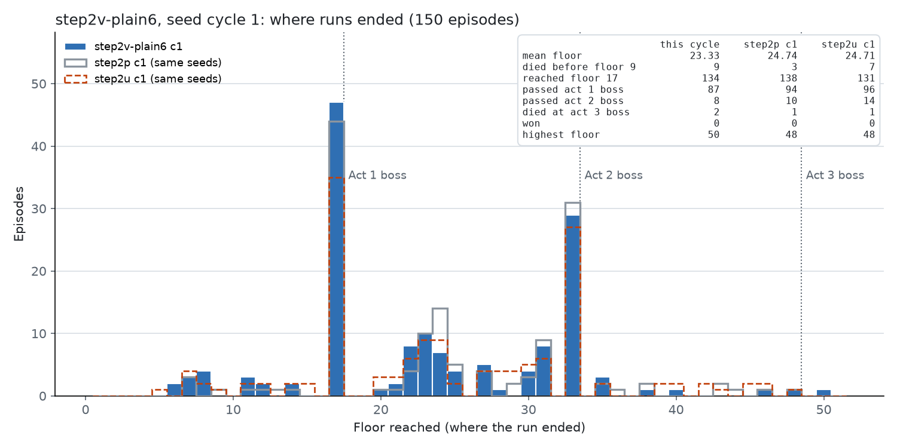
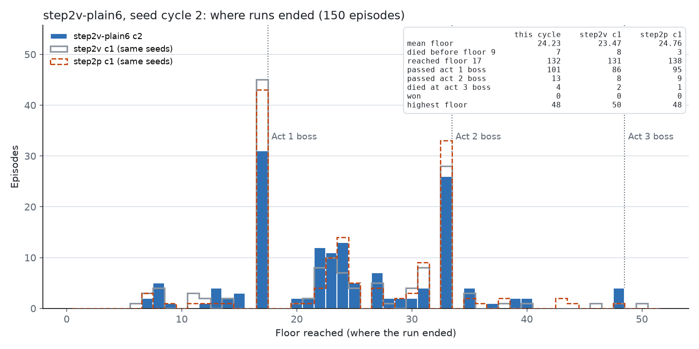
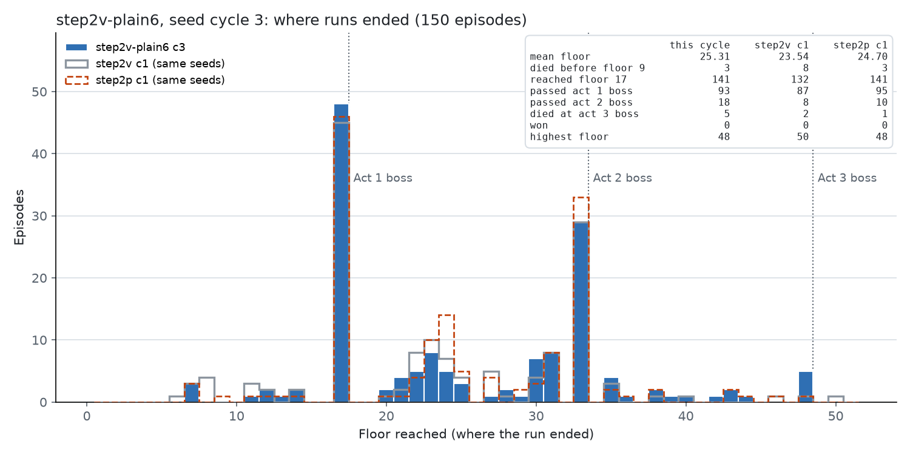
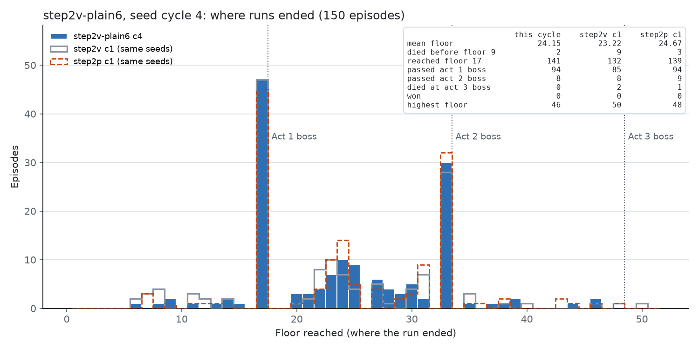
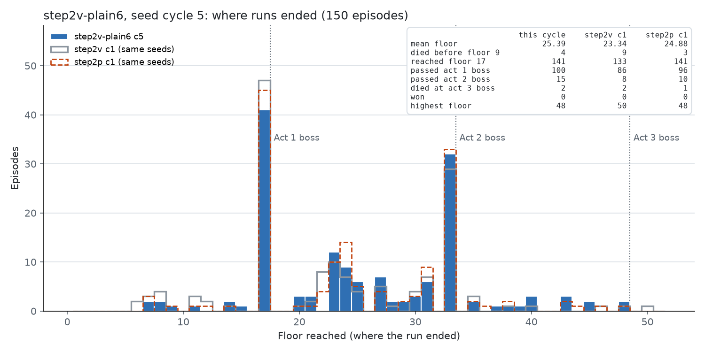
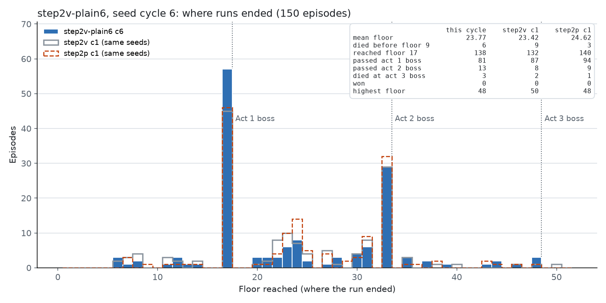

# Step 2-v：从最好的 checkpoint 做 6 个周期的普通 PPO（`runs/step2v-plain6`）

*2026-10-07 12:19 ~ 22:58，900 局，331 次更新*

## 一句话

Step 2-s（探索）和 2-u（KL 约束）都没有在 holdout 上超过起点 p060，所以按 Lucien 的决定，从 p060 跑 6 个周期的普通 PPO（和 Step 2-p 完全相同的训练，只是长一倍），看单纯多训练能不能提高。**结果：不能。** 6 个周期的训练池平均在 23.3–25.4 之间波动，没有趋势；6 个周期末的 checkpoint 在 holdout 上都没有超过 p060（已完成的 4 个：−0.67 / −2.28 / −0.14 / −1.84）；升级、跳过选牌的概率全程为 0；通关 0。加上 Step 2-n 的 4 个周期和 Step 2-p 的 3 个周期，**同一种训练已经跑了 13 个周期，没有一个周期末的策略在 holdout 上好于 p060**。

## 训练方式

- `--init-from runs/step2p-fast/checkpoints/update_000060.pt --init-optimizer`：holdout 上最好的 checkpoint（[step2r-holdout-eval.md](step2r-holdout-eval.md)）。
- 没有探索（`exploration` 为空），没有参考 KL（β = 0，映射为空）：代码在这两个开关关闭时和 Step 2-p 的训练逐位相同（测试固定）。
- 10 个模拟器（15600–15609），MCTS 50 / boss 200，`target_kl` 0.02，lr 3e-4，rollout 256，每 5 次更新一个 checkpoint，默认 seed 池 150 个，`--holdout-seeds default`，**900 局 = 6 个周期**。
- 代码 `feat/mcts-combat` 的 `bc64f0d`；驱动脚本 `runs/step2v_driver.sh`。
- 10 小时 39 分钟，84 局/小时。0 错误，0 截断。
- 周期评估（`runs/step2v_cycle_eval.sh`）：每到 150 局立即记录 checkpoint 并探测；holdout 评估（30 seed × 3，argmax）排队在 2 个单独的模拟器上跑（15612–15613），第 6 周期末改用训练结束后空出的 6 个模拟器。

## 结果

### 每个周期（训练中，按概率采样）

| 周期 | checkpoint | 平均楼层 | 到第 17 层 | 过第 1 幕 boss | 过第 2 幕 boss | 第 3 幕 boss 死亡 | 第 9 层前死亡 | 对上一周期（同 seed） | 对 Step 2-p 三周期平均（同 seed） |
|---|---|---|---|---|---|---|---|---|---|
| 1 | `update_000054` | 23.33 | 134 | 87 / 134（65%） | 8 | 2 | 9 | — | −0.71（p = 0.93） |
| 2 | `update_000108` | 24.23 | 132 | 101 / 132（77%） | 13 | 4 | 7 | +0.90（p = 0.50） | +0.15（p = 0.74） |
| 3 | `update_000168` | 25.31 | 141 | 93 / 141（66%） | 18 | 5 | 3 | +1.08（p = 0.50） | +1.42（p = 0.13） |
| 4 | `update_000223` | 24.15 | 141 | 94 / 141（67%） | 8 | 0 | 2 | −1.43（p = 0.37） | +0.24（p = 1.0） |
| 5 | `update_000277` | 25.39 | 141 | 100 / 141（71%） | 15 | 2 | 4 | +0.99（p = 0.63） | +1.27（p = 0.064） |
| 6 | `update_000331` | 23.77 | 138 | 81 / 138（59%） | 13 | 3 | 6 | −1.76（40 高 / 62 低，**p = 0.037**） | −0.09（p = 0.74） |

全部 900 局对 Step 2-p 三周期平均：23.98 → 24.36（+0.38，441 高 / 401 低，p = 0.18）。

第 3 幕 boss：按搜索记录的房间类型，900 局中进入第 3 幕 boss 战 16 次（15 次在第 48 层，1 次在第 50 层——CNL0342G9S 的第 3 幕多两层），全部失败。通关 0。seed：4UEVB4R020（2 次）、CNL0342G9S、0ZTT4AKVKQ（2 次）、3PANEGKLP8（2 次）、0PCBECVTPL、FHHFSB5W4C、6S8W3SPCTK、G5BKM8N1PE、RPQCVYAC73、V1WJ9EMZ3B、H14T0C5F9B、ZL6K7D783Q。

### holdout 评估（argmax，30 seed × 3，对 p060 同 seed）

| checkpoint | 局数 | 平均楼层 | 过第 1 幕 boss | 对 p060 | 更高 / 更低 / 相同 | p |
|---|---|---|---|---|---|---|
| p060（起点，Step 2-r） | 90 | 26.30 | 67 / 81 | — | — | — |
| 周期 1 末 `update_000054` | 90 | 25.19 | 61 / 84 | −0.67 | 11 / 14 / 5 | 0.69 |
| 周期 2 末 `update_000108` | 90 | 23.58 | 54 / 83 | −2.28 | 9 / 16 / 5 | 0.23 |
| 周期 3 末 `update_000168` | 90 | 25.71 | 63 / 84 | −0.14 | 13 / 14 / 3 | 1.00 |
| 周期 4 末 `update_000223` | 90 | 24.01 | 51 / 78 | −1.84 | 11 / 14 / 5 | 0.69 |
| 周期 5 末 `update_000277` | 未完成 | | | | | |
| 周期 6 末 `update_000331` | 未完成 | | | | | |

### 探测（人类录像的 1317 个宏观界面）

| 界面 | 选项 | 人类 | p060 | c1 | c2 | c3 | c4 | c5 | c6 |
|---|---|---|---|---|---|---|---|---|---|
| 营火 | 升级 | 0.65 | 0.01 | 0.00 | 0.00 | 0.01 | 0.00 | 0.02 | 0.03 |
| 营火 | 休息，HP > 80% | 0.06 | 0.83 | 0.85 | 0.83 | 0.82 | 0.80 | 0.92 | 0.79 |
| 选牌奖励 | 跳过 | 0.52 | 0.00 | 0.00 | 0.00 | 0.00 | 0.00 | 0.00 | 0.01 |
| 选牌奖励 | 和 p060 的 argmax 一致率 | — | 1.00 | 0.56 | 0.59 | 0.50 | 0.49 | 0.42 | 0.43 |
| 商店 | 买牌 | 0.22 | 0.92 | 0.98 | 0.43 | 0.32 | 0.98 | 0.99 | 0.99 |
| 商店 | 遗物 / 药水 | 0.18 / 0.04 | 0.02 / 0.08 | 0.01 / 0.02 | 0.37 / 0.48 | 0.48 / 0.54 | 0.01 / 0.03 | 0.02 / 0.00 | 0.00 / 0.01 |
| 地图 | 精英（提供时） | — | 0.06 | 0.01 | 0.02 | 0.02 | 0.00 | 0.02 | 0.03 |

- 升级和跳过全程为 0，和 Step 2-n、2-p、2-s 一样：普通 PPO 不会自己恢复它们。
- 选哪张牌的策略一直在动（一致率降到 0.43），这是训练主要改变的东西。
- 商店策略来回摆：第 2、3 周期末偏向遗物和药水，其他周期末几乎只买牌。Step 2-s 里也出现过同样的摆动。

### 进入第 1 幕 boss 时的状态（平均）

| 周期 | HP | 牌组 | 升级牌 | 药水 | 遗物 | 金币 | 第 1 幕 boss 死亡率 | 第 2 幕 boss 死亡率 |
|---|---|---|---|---|---|---|---|---|
| 1 | 90% | 20.2 | 0.74 | 0.69 | 3.92 | 140 | 33% | 81% |
| 2 | 92% | 19.7 | 0.66 | 0.78 | 3.95 | 138 | 23% | 74% |
| 3 | 93% | 18.7 | 0.68 | 0.68 | 4.19 | 159 | 34% | 68% |
| 4 | 93% | 19.3 | 0.56 | 0.77 | 4.19 | 159 | 35% | 80% |
| 5 | 92% | 20.9 | 0.67 | 0.67 | 4.14 | 145 | 28% | 70% |
| 6 | 92% | 20.5 | 0.59 | 0.60 | 4.01 | 146 | 44% | — |

升级牌一直在 0.6–0.7 张（Step 2-u 是 1.3 张，人类 3.8 张）。Waterfall Giant 仍然是最难的第 1 幕 boss（死亡率 36–86%）。第 2 幕 boss 死亡率 68–81%，没有变化。

### 训练指标

| 周期 | 更新 | 停止时 KL 中位 | KL > 0.3 的次数 | 优化步中位 | 熵 | 价值损失（均 / 最高） | 梯度范数中位 | 回报缩放 |
|---|---|---|---|---|---|---|---|---|
| 1 | 56 | 0.047 | 2 | 10 | 0.56 | 0.08 / 0.39 | 0.92 | 13.12 |
| 2 | 55 | 0.068 | 3 | 9 | 0.67 | 0.09 / 0.44 | 0.98 | 13.48 |
| 3 | 58 | 0.051 | 6 | 8 | 0.56 | 0.06 / 0.24 | 1.04 | 13.68 |
| 4 | 54 | 0.069 | 2 | 8 | 0.61 | 0.06 / 0.21 | 1.12 | 13.88 |
| 5 | 57 | 0.067 | 5 | 7 | 0.62 | 0.08 / 0.47 | 1.11 | 14.16 |
| 6 | 51 | 0.088 | 9 | 7 | 0.53 | 0.09 / 0.56 | 1.10 | 14.38 |

训练过程稳定，没有 critic 崩溃。停止时 KL 超过 0.3 的尖峰（最高 1.2）在普通 PPO 里也有，说明它不是参考项特有的现象（见 Step 2-t/2-u 的记录）。回报缩放从 13.1 升到 14.4，说明回报在略微变大，但 holdout 没有跟着变。

## 结论

1. **单纯多训练不提高。** 6 个周期在 23.3–25.4 之间波动，4 个已评估的周期末在 holdout 上都不高于起点；第 6 周期还显著低于第 5 周期（p = 0.037）。
2. **13 个周期的同类训练（Step 2-n 4 个、2-p 3 个、2-v 6 个）都没有超过 p060。** 这是一个完整的对照：PPO 在现在的奖励、critic 和特征下已经到了上限，再多的周期只会在平台期上下波动。
3. 平台期的直接原因没有变：升级 0、跳过 0、商店策略摆动、第 2 幕 boss 死亡率 70–80%、第 3 幕 boss 0 胜。
4. 下一个有希望的改动必须是结构性的：让 critic 看到升级的价值（例如更长视野的价值目标、牌组强度特征），或者更强的先验（Step 2-u 的营火 β 提高到 0.3），或者改奖励。

## 下一步（待 Lucien 决定）

- Step 2-u 的方向加大：营火 β 0.3，看升级牌能否到 2 张以上。
- 或者先分析第 2、3 幕 boss 战为什么输（牌组 vs 搜索），再决定改哪里。
