# Step 2-w：从 Step 2-v 末尾继续 20 个周期的普通 PPO（`runs/step2w-plain10`）

*2026-10-07 23:57 ~ 2026-10-09 10:50，3000 局，1035 次更新，分三次启动*

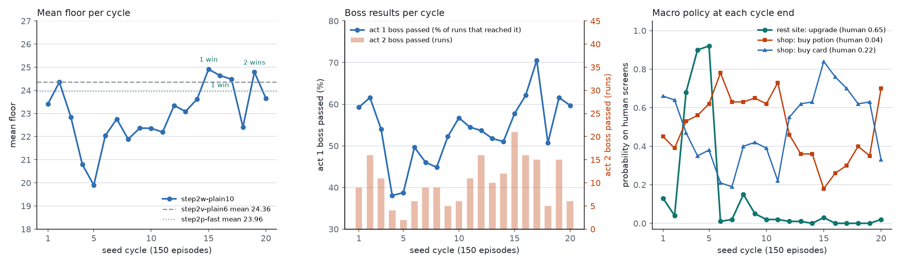

## 一句话

从 Step 2-v 的最后一个 checkpoint 继续做普通 PPO，先定 10 个周期，按 Lucien 的决定扩到 20 个周期。**训练池的平均楼层在 19.9–24.9 之间波动，没有持续上升的趋势**；全部 3000 局对 Step 2-v 六周期的平均（同 seed）低 1.36 层（p < 0.001）。但是第 15–19 周期出现了**项目的第一批通关：4 局**（3 个 seed），记录在 [wins.md](wins.md)。第 3–5 周期策略短暂学会了在营火升级（概率 0.68–0.92），但同时不再休息，进入第 1 幕 boss 时 HP 只有 55%，平均楼层跌到 19.9；之后升级概率回到 0。第 18 周期的第 1 幕 boss 胜率从 71% 跌到 51%，进入状态、牌组和宏观选择都没有变化，第 19 周期又回到 62%：**一个周期 150 局的平均楼层本身就有约 ±1.5 层的随机波动**。

## 训练方式

### 起点和设置

- `--init-from runs/step2v-plain6/checkpoints/update_000331.pt --init-optimizer`：Step 2-v 第 6 周期末的 checkpoint，连同 Adam 的矩（[step2v-plain6.md](step2v-plain6.md)）。
- 普通 PPO：没有探索（`exploration` 为空），没有参考 KL（`reference_kl_coefficient` 0.0）。
- PPO：学习率 3e-4，rollout 256，minibatch 32，4 个 epoch，clip 0.2，`target_kl` 0.02（超过 0.03 停止这次更新），γ 0.999，λ 0.98，熵系数 0.01，价值系数 0.5，梯度裁剪 0.5。
- 奖励：每进入一个节点 +1，每打赢一个 boss +10，每步 −0.01。
- 战斗：全部由 MCTS 决定，不进 rollout（`--search-fights-out-of-rollout`）。普通和精英战 50 次模拟，boss 战 200 次，树深 2 回合，32 个 reseed，叶子评估权重 `search/weights/act1_boss_step1b.json`，带 Step 2-l 的两个评估修复。
- 环境：STS2Simulator，10 个模拟器（15600–15609），默认 seed 池（150 个训练 seed，一个周期 150 局），`--holdout-seeds default`。每 5 次更新一个 checkpoint。CPU 训练。
- 训练中不做 holdout 评估；每个周期末记录 checkpoint、运行策略探测（`scripts/policy_probe.py`）、画楼层分布图。

### 三次启动

| 启动 | 时间 | 局 | 代码 | 驱动日志 |
|---|---|---|---|---|
| 1 | 2026-10-07 23:57 ~ 10-08 12:50 | 1–1500（10 个周期） | `339c7fe` | `runs/step2w-plain10.driver.log` |
| 2 | 2026-10-08 12:51 ~ 19:05 | 1501–2124 | `339c7fe` | `runs/step2w-plain10.driver2.log`（按 Lucien 的指令在 2125 局时暂停） |
| 3 | 2026-10-09 01:04 ~ 10:50 | 2125–3000 | `56999af` | `runs/step2w-plain10.driver3.log` |

第 2、3 次启动用 `--resume --total-episodes 3000`，其余设置都从 checkpoint 读取。第 3 次启动从 `update_000718`（已完成 2124 局）恢复，暂停前在这个 checkpoint 之后完成的 2 局（2125、2126）被重新开始，所以 `metrics.jsonl` 里这两个局号出现两次；分析时同一局号取最后一条。

```bash
# 第 1 次
uv run sts2rl-train --run-dir runs/step2w-plain10 --backend sim --base-url http://localhost:15600/api/v1 \
  --ports 15600,15601,15602,15603,15604,15605,15606,15607,15608,15609 --seed-pool default --holdout-seeds default \
  --init-from runs/step2v-plain6/checkpoints/update_000331.pt --init-optimizer \
  --search-combat --search-fights-out-of-rollout --search-boss-simulations 200 --target-kl 0.02 \
  --checkpoint-every 5 --total-episodes 1500
# 第 2、3 次
uv run sts2rl-train --run-dir runs/step2w-plain10 --resume --total-episodes 3000
```

- 速度：第 3 次启动约 90 局/小时（局变长，平均到第 24 层）。截断 0，action error 0。
- 周期记录脚本：`runs/step2w_cycle_record.sh`（周期 1–10）、`runs/step2w_cycle_record2.sh`（11–14）、`runs/step2w_cycle_record3.sh`（15–20，按最大局号判断周期边界）。
- 通关自动保存：`runs/step2w_win_saver.sh` 调用 `runs/tools/save_win.py`（第 3 次启动后加入）。

## 结果

### 每个周期（训练中，按概率采样）

| 周期 | checkpoint | 平均楼层 | 最高 | 到第 17 层 | 过第 1 幕 boss | 过第 2 幕 boss | 第 3 幕 boss 死亡 | 通关 | 第 9 层前死亡 | 对上一周期（同 seed） | 对 Step 2-v 六周期平均（同 seed） |
|---|---|---|---|---|---|---|---|---|---|---|---|
| 1 | `update_000054` | 23.41 | 50 | 135 | 80 / 135（59%） | 9 | 2 | 0 | 5 | — | −0.86（62 高 / 84 低，p = 0.082） |
| 2 | `update_000108` | 24.35 | 48 | 138 | 85 / 138（62%） | 16 | 7 | 0 | 6 | +0.29（p = 1） | +0.10（p = 0.078） |
| 3 | `update_000156` | 22.85 | 48 | 137 | 74 / 137（54%） | 11 | 5 | 0 | 6 | −1.63（p = 0.52） | −1.42（p = 0.0036） |
| 4 | `update_000204` | 20.79 | 48 | 134 | 51 / 134（38%） | 4 | 1 | 0 | 3 | −2.46（36 高 / 64 低，p = 0.0066） | −3.67（p < 0.001） |
| 5 | `update_000252` | 19.90 | 38 | 129 | 50 / 129（39%） | 2 | 0 | 0 | 7 | −0.74（p = 0.61） | −4.34（p < 0.001） |
| 6 | `update_000300` | 22.04 | 48 | 137 | 68 / 137（50%） | 6 | 1 | 0 | 2 | +2.01（58 高 / 36 低，p = 0.03） | −2.24（p < 0.001） |
| 7 | `update_000354` | 22.76 | 48 | 139 | 64 / 139（46%） | 9 | 3 | 0 | 3 | +0.53（p = 0.52） | −1.60（p < 0.001） |
| 8 | `update_000402` | 21.89 | 48 | 136 | 61 / 136（45%） | 9 | 3 | 0 | 3 | −0.86（p = 0.37） | −2.37（p < 0.001） |
| 9 | `update_000450` | 22.37 | 48 | 134 | 70 / 134（52%） | 5 | 2 | 0 | 2 | +0.44（p = 0.92） | −1.89（p = 0.0068） |
| 10 | `update_000502` | 22.36 | 44 | 134 | 76 / 134（57%） | 6 | 0 | 0 | 8 | −0.34（p = 1） | −2.27（p = 0.0025） |
| 11 | `update_000550` | 22.19 | 50 | 134 | 73 / 134（54%） | 11 | 2 | 0 | 5 | −0.08（p = 1） | −2.10（p < 0.001） |
| 12 | `update_000604` | 23.35 | 50 | 136 | 73 / 136（54%） | 16 | 4 | 0 | 2 | +0.92（p = 0.92） | −0.85（p = 0.025） |
| 13 | `update_000658` | 23.09 | 48 | 143 | 74 / 143（52%） | 10 | 2 | 0 | 3 | −0.65（p = 0.42） | −1.37（p = 0.0068） |
| 14 | `update_000706` | 23.62 | 48 | 143 | 73 / 143（51%） | 12 | 3 | 0 | 2 | +0.33（p = 0.35） | −0.72（p = 0.13） |
| 15 | `update_000766` | **24.91** | 50 | 142 | 82 / 142（58%） | **21** | 8 | **1** | 3 | +1.34（p = 0.34） | +0.65（p = 0.11） |
| 16 | `update_000820` | 24.64 | 48 | 140 | 87 / 140（62%） | 16 | 5 | **1** | 4 | −0.79（p = 0.61） | +0.29（p = 0.21） |
| 17 | `update_000874` | 24.48 | 48 | 129 | 91 / 129（71%） | 15 | 6 | 0 | 6 | −0.28（p = 1） | +0.28（p = 0.56） |
| 18 | `update_000928` | 22.41 | 48 | 134 | 68 / 134（51%） | 5 | 2 | 0 | 5 | −2.60（44 高 / 61 低，p = 0.12） | −2.07（p < 0.001） |
| 19 | `update_000982` | 24.79 | 48 | 138 | 85 / 138（62%） | 15 | 3 | **2** | 4 | +2.41（59 高 / 42 低，p = 0.11） | +0.46（p = 0.68） |
| 20 | `update_001035` | 23.65 | 48 | 139 | 83 / 139（60%） | 6 | 1 | 0 | 5 | −1.49（38 高 / 55 低，p = 0.097） | −0.92（p = 0.0032） |

全部 3000 局：平均 22.99，最高 50；对 Step 2-v 六周期平均（同 seed）−1.36（1105 高 / 1822 低，p < 0.001）。p 是符号检验。周期按局号切分（第 c 周期 = 第 150(c−1)+1 到 150c 局）。

- 第 15–17、19 周期是这一阶段最好的部分（24.5–24.9），和 Step 2-v 持平（差 +0.3 到 +0.7，不显著），但没有超过它。
- 第 4–5 周期的下跌和营火升级有关（见下面的探测和进入状态）。

### 通关和第 3 幕 boss

**通关 4 局**（详见 [wins.md](wins.md)；检查点和这一局的战斗记录保存在本机 `runs/wins/`）：

| 局 | 周期 | seed | 三个 boss | 进入 boss 战时 HP |
|---|---|---|---|---|
| 2210 | 15 | `JEQSXL4XVT` | Soul Fysh → The Insatiable → Aeonglass | 69/82 → 82/82 → 80/82 |
| 2285 | 16 | `3EH64E978B` | Lagavulin Matriarch → The Insatiable → Aeonglass | 87/87 → 77/87 → 88/101 |
| 2734 | 19 | `3EH64E978B` | Lagavulin Matriarch → The Insatiable → Aeonglass | 87/87 → 40/87 → 85/101 |
| 2746 | 19 | `4UEVB4R020` | Ceremonial Beast → Knowledge Demon → Aeonglass | 82/85 → 85/85 → 74/86 |

- 4 局的第 3 幕 boss 都是 Aeonglass。
- 进入第 3 幕 boss 战（楼层 ≥ 48）共 64 局，其中 60 局失败。多次死在第 3 幕 boss 的 seed：`H14T0C5F9B`（6 次）、`CNL0342G9S`（4 次）、`5XH4KM54TQ`（3 次）、`0ZTT4AKVKQ`、`WK11RMT05Q`、`EU058TPXR2`、`XMATWPFYRY`、`PFFQ609NM0`、`NYBVL26E3R`、`PUHV5ZWXW6`、`XRY1E24VDR`、`QU1EDZHZW2`、`VKYQ6RHFQY`、`6S8W3SPCTK`（各 2 次）。
- `3EH64E978B` 在前 15 个周期里有 10 次死在第 1 幕 boss，最高只到第 28 层，之后连续两次通关（周期 16、19）。
- 通关只发生在训练 seed 上；这一阶段没有做 holdout 评估。

### floor 分布

| | |
|---|---|
| 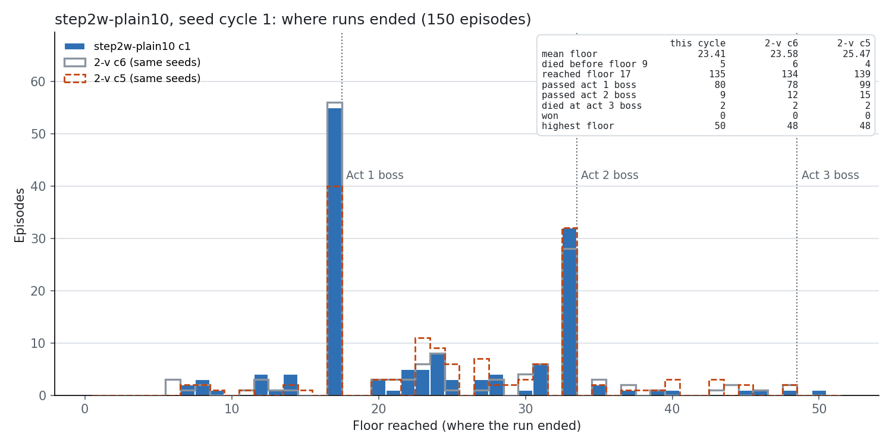 | 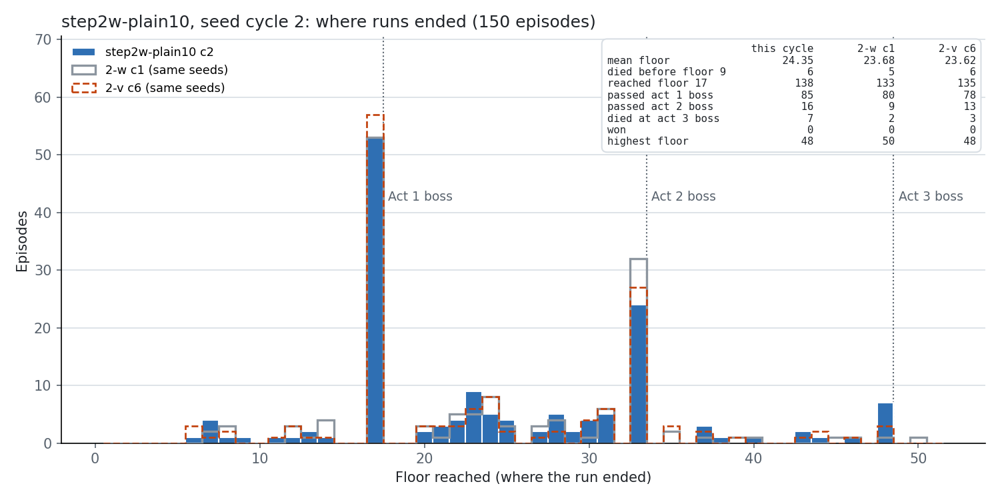 |
| 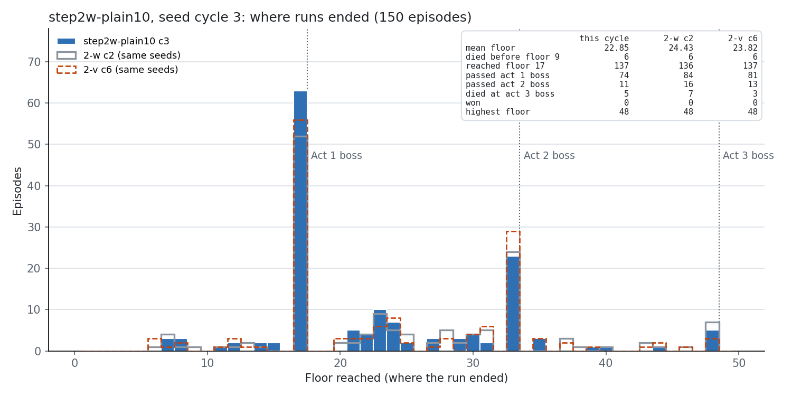 | 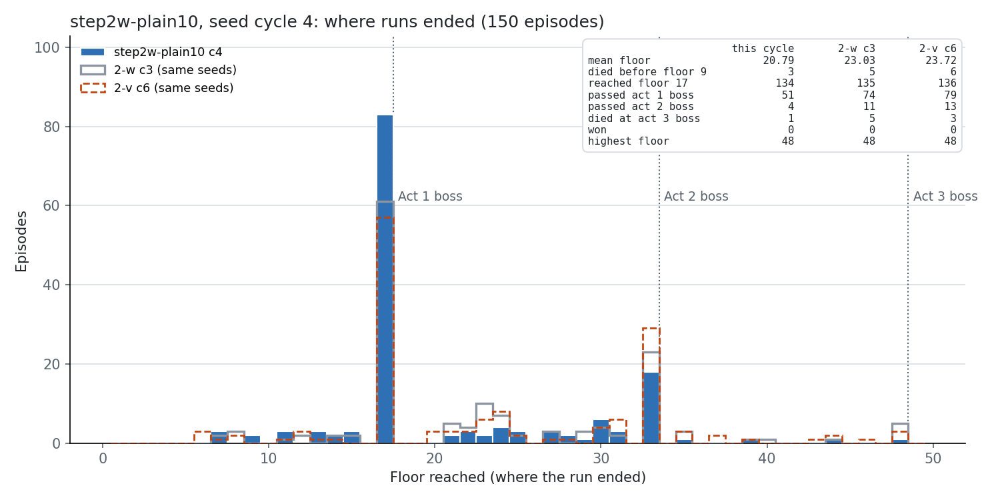 |
| 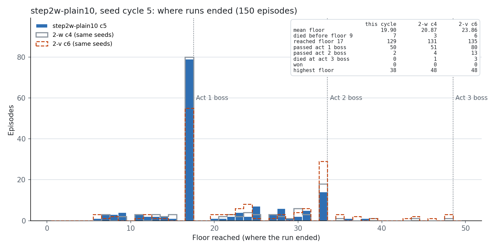 | 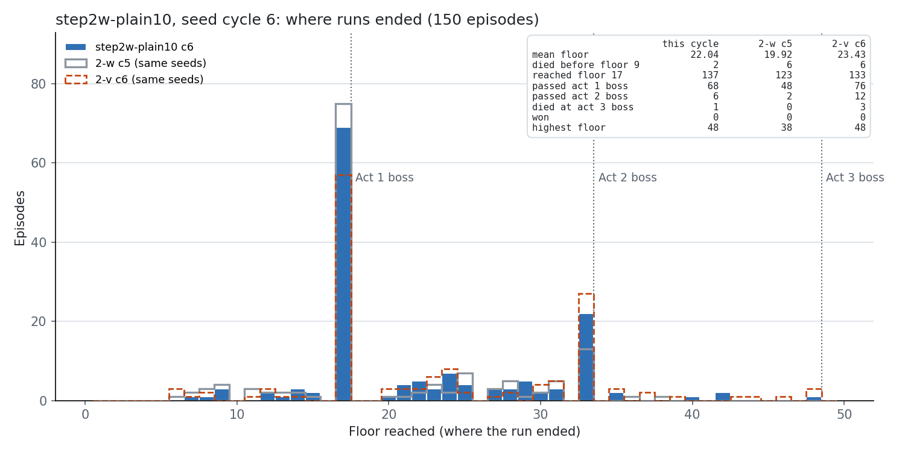 |
| 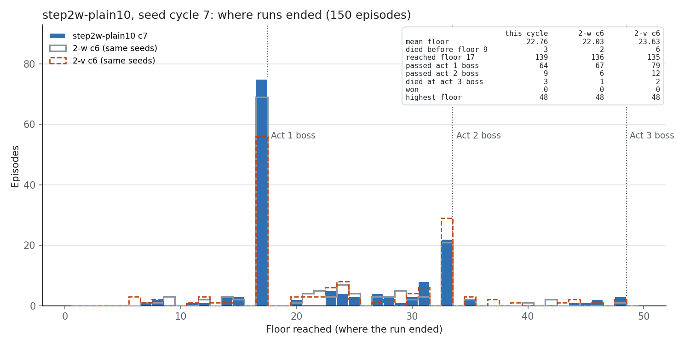 | 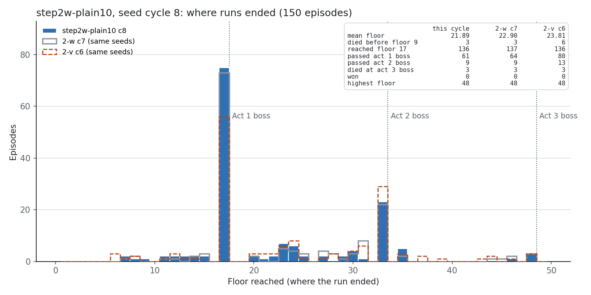 |
| 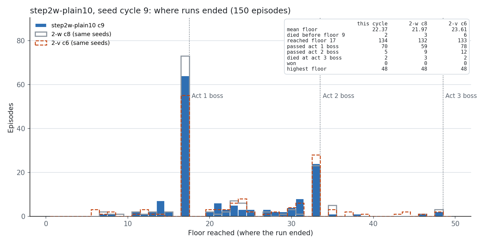 | 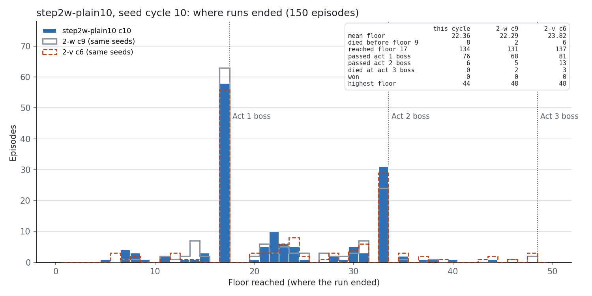 |
| 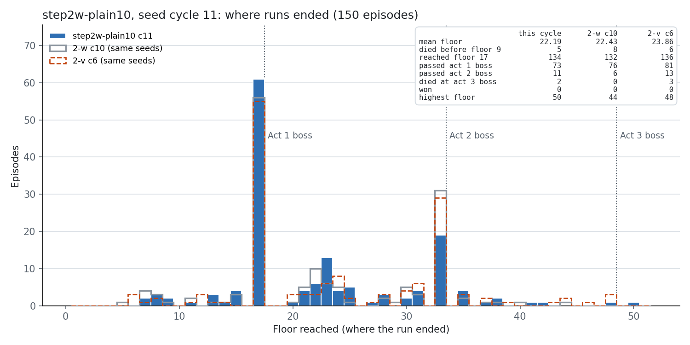 | 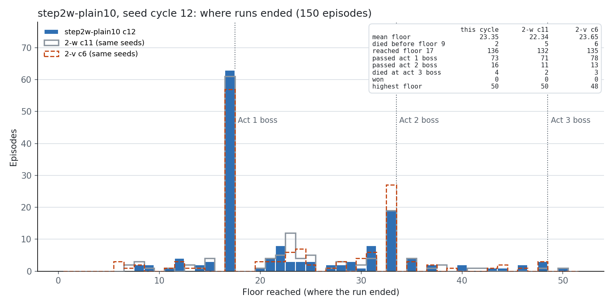 |
| 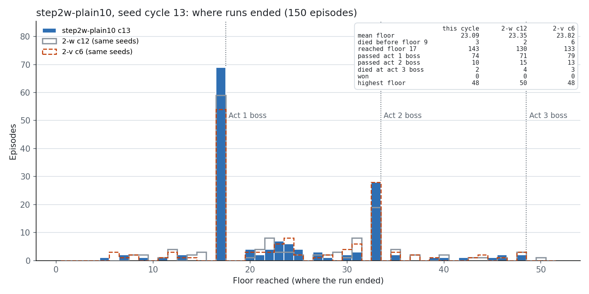 | 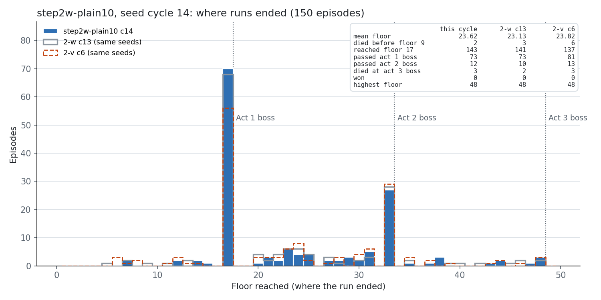 |
| 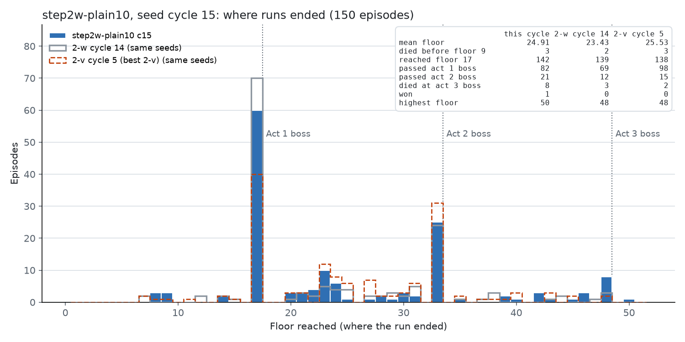 | 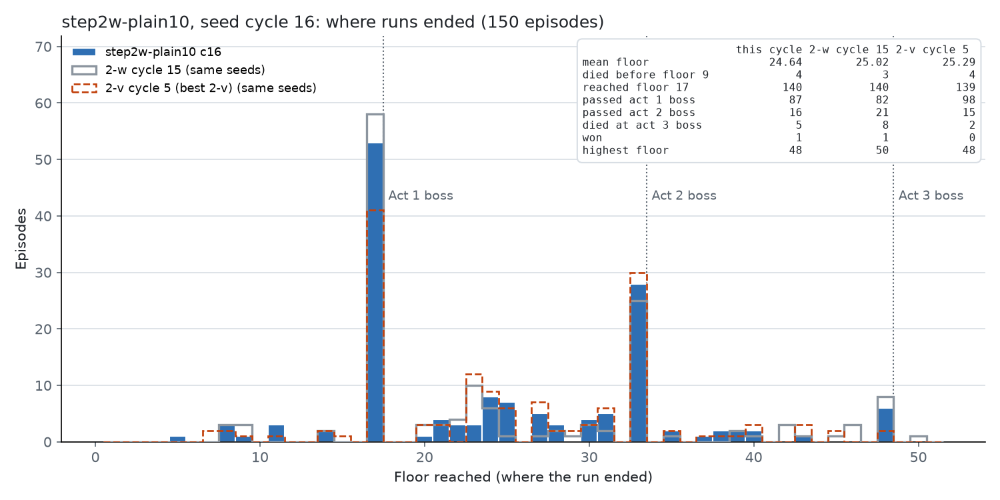 |
| 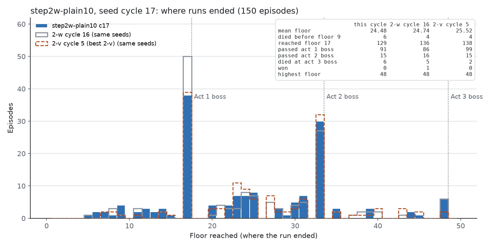 | 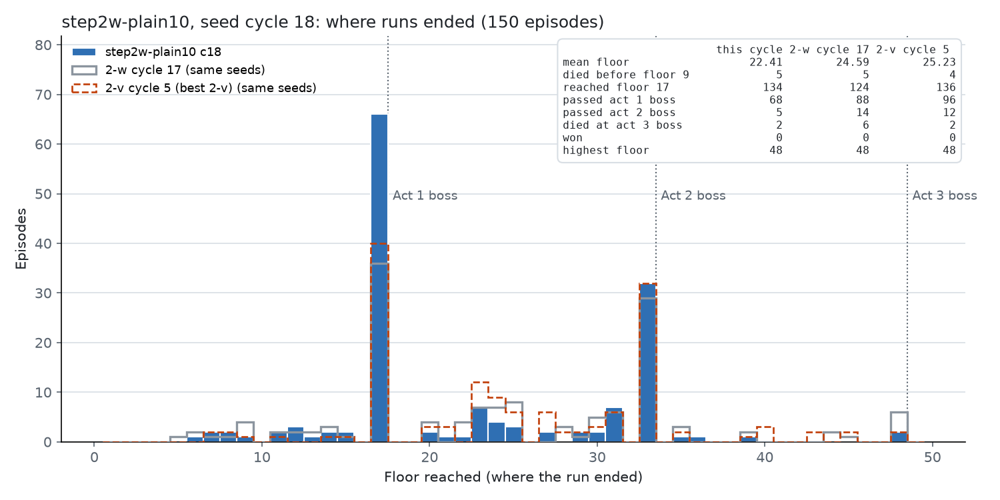 |
| 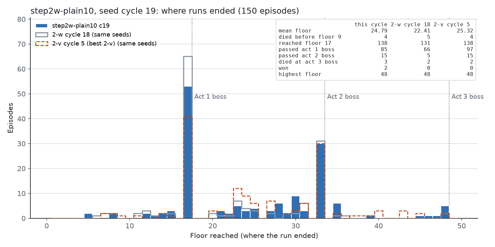 | 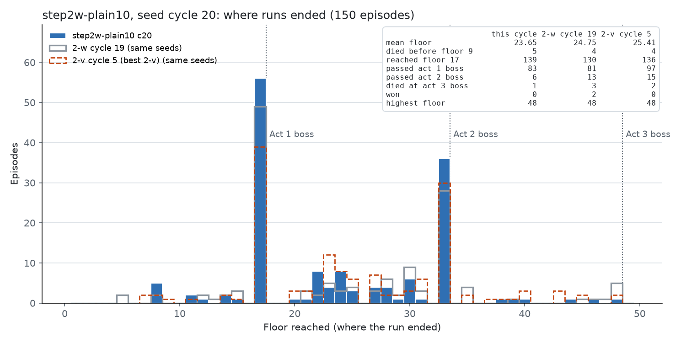 |

第 15–20 周期的图对比上一个周期和 Step 2-v 第 5 周期（Step 2-v 最好的周期）；第 1–14 周期的图由之前的会话画，参照见各图图例。

### 探测（人类录像的 1317 个宏观界面，每个周期末的 checkpoint）

每个数是"在提供这个选项的界面上，策略选它的概率"的平均，所以商店的几项加起来不等于 1。

| 选项 | 人类 | c1 | c2 | c3 | c4 | c5 | c6 | c7 | c8 | c9 | c10 | c11 | c12 | c13 | c14 | c15 | c16 | c17 | c18 | c19 | c20 |
|---|---|---|---|---|---|---|---|---|---|---|---|---|---|---|---|---|---|---|---|---|---|
| 营火 升级 | 0.65 | 0.13 | 0.04 | **0.68** | **0.90** | **0.92** | 0.01 | 0.02 | 0.15 | 0.05 | 0.02 | 0.02 | 0.01 | 0.01 | 0.00 | 0.03 | 0.00 | 0.00 | 0.00 | 0.00 | 0.02 |
| 营火 休息，HP > 80% | 0.06 | 0.87 | 0.85 | 0.39 | 0.19 | 0.12 | 1.00 | 0.88 | 0.87 | 0.97 | 0.99 | 0.90 | 1.00 | 1.00 | 1.00 | 0.89 | 0.86 | 1.00 | 1.00 | 0.99 | 0.90 |
| 选牌 跳过 | 0.52 | 0.00 | 0.00 | 0.00 | 0.01 | 0.04 | 0.03 | 0.02 | 0.00 | 0.00 | 0.00 | 0.00 | 0.00 | 0.01 | 0.02 | 0.05 | 0.06 | 0.01 | 0.01 | 0.03 | 0.10 |
| 商店 买牌 | 0.22 | 0.66 | 0.64 | 0.47 | 0.35 | 0.38 | 0.21 | 0.19 | 0.40 | 0.42 | 0.39 | 0.22 | 0.55 | 0.62 | 0.63 | 0.84 | 0.76 | 0.70 | 0.62 | 0.63 | 0.33 |
| 商店 买药水 | 0.04 | 0.45 | 0.39 | 0.53 | 0.56 | 0.62 | 0.78 | 0.63 | 0.63 | 0.65 | 0.62 | 0.73 | 0.46 | 0.36 | 0.36 | 0.18 | 0.26 | 0.30 | 0.40 | 0.35 | 0.70 |
| 商店 买遗物 | 0.18 | 0.18 | 0.22 | 0.31 | 0.44 | 0.55 | 0.73 | 0.50 | 0.50 | 0.46 | 0.51 | 0.57 | 0.37 | 0.30 | 0.29 | 0.10 | 0.16 | 0.20 | 0.23 | 0.30 | 0.61 |
| 地图 精英 | 0.08 | 0.03 | 0.03 | 0.02 | 0.04 | 0.08 | 0.00 | 0.01 | 0.01 | 0.01 | 0.02 | 0.01 | 0.01 | 0.02 | 0.03 | 0.11 | 0.01 | 0.01 | 0.00 | 0.00 | 0.00 |
| 地图 营火 | 0.20 | 0.99 | 0.96 | 0.99 | 0.98 | 0.97 | 0.98 | 0.95 | 0.91 | 0.88 | 0.93 | 0.93 | 0.83 | 0.91 | 0.85 | 0.76 | 0.94 | 0.98 | 0.95 | 0.93 | 0.99 |

- **营火升级只在第 3–5 周期出现**（0.68–0.92），同时 HP > 80% 时休息的概率降到 0.12–0.39。第 6 周期起回到"总是休息"（0.86–1.00），升级 0.00–0.05。
- **选牌奖励的"跳过"一直接近 0**（最高 0.10，人类 0.52）。
- **商店策略一直在摆**：买药水 0.18–0.78，买牌 0.19–0.84，买遗物 0.10–0.73，没有收敛。第 20 周期末偏向药水和遗物（0.70 / 0.61）。
- 地图上几乎不选精英（0.00–0.11），但几乎总是选营火（0.76–0.99，人类 0.20）。

### 进入第 1 幕 boss 时的状态（平均）

| 周期 | 进入局数 | HP | 牌组 | 升级牌 | 药水 | 遗物 | 金币 | 第 1 幕 boss 死亡率 | 第 2 幕 boss 死亡率 |
|---|---|---|---|---|---|---|---|---|---|
| 1 | 135 | 90% | 20.3 | 0.76 | 0.70 | 4.26 | 115 | 39% | 80% |
| 2 | 138 | 88% | 19.5 | 0.68 | 0.86 | 4.38 | 132 | 39% | 62% |
| 3 | 138 | 90% | 18.8 | 0.74 | 0.70 | 4.22 | 117 | 46% | 71% |
| 4 | 133 | **55%** | 18.6 | **3.74** | 0.71 | 4.15 | 115 | **62%** | 89% |
| 5 | 130 | **55%** | 18.3 | **3.70** | 0.78 | 4.02 | 99 | **61%** | 87% |
| 6 | 137 | 83% | 18.7 | 1.31 | 0.74 | 4.28 | 120 | 49% | 78% |
| 7 | 139 | 87% | 18.0 | 0.94 | 0.73 | 4.26 | 114 | 53% | 76% |
| 8 | 137 | 85% | 18.0 | 0.96 | 0.68 | 4.20 | 120 | 56% | 85% |
| 9 | 133 | 90% | 18.7 | 0.64 | 0.74 | 4.03 | 112 | 47% | 89% |
| 10 | 128 | 90% | 18.9 | 0.78 | 0.77 | 4.06 | 118 | 43% | 90% |
| 11 | 132 | 88% | 18.8 | 0.75 | 0.87 | 4.42 | 127 | 45% | 79% |
| 12 | 133 | 91% | 18.9 | 0.76 | 0.79 | 4.02 | 118 | 44% | 63% |
| 13 | 145 | 92% | 19.2 | 0.63 | 0.68 | 4.22 | 117 | 48% | 73% |
| 14 | 143 | 92% | 19.3 | 0.69 | 0.78 | 3.94 | 101 | 50% | 74% |
| 15 | 131 | 93% | 19.7 | 0.67 | 0.66 | 4.02 | 104 | 42% | 56% |
| 16 | 139 | 94% | 19.7 | 0.64 | 0.81 | 4.00 | 104 | 36% | 65% |
| 17 | 133 | 91% | 19.9 | 0.58 | 0.71 | 4.21 | 126 | 33% | 70% |
| 18 | 133 | 89% | 19.7 | 0.62 | 0.62 | 4.17 | 147 | 49% | 85% |
| 19 | 139 | 91% | 19.1 | 0.60 | 0.91 | 4.24 | 123 | 36% | 80% |
| 20 | 151 | 90% | 19.4 | 0.64 | 0.75 | 4.35 | 130 | 42% | 84% |

这张表按搜索记录的 run id 第一次出现的顺序分周期（战斗记录没有 seed），周期边界可能差几局，所以数和上面按局号的表略有不同。

- **第 4–5 周期：升级牌 3.7 张（人类 3.8 张），但进入时 HP 只有 55%，第 1 幕 boss 死亡率 61–62%。** 升级的价值被少休息的代价抵消了，而且抵消得更多。这和 Step 2-u 的结果一致（升级概率 0.26 时 HP 降到 83%，楼层持平），只是这里来得更极端。
- 其余周期：HP 83–94%，升级牌 0.6–1.3 张，牌组 18–20 张，遗物 3.9–4.4 个，约三分之一的局带着 150 以上没花的金币进 boss 战。
- 第 2 幕 boss 死亡率 56–90%，是第 1 幕 boss 之后的第二道墙。

### 第 18 周期为什么下跌

第 18 周期的第 1 幕 boss 胜率从第 17 周期的 71% 跌到 51%，第 19 周期又回到 62%。逐项排除：

- **进入状态**：HP 89%、牌组 19.7 张、升级 0.62、遗物 4.17，和第 16、17 周期几乎相同。
- **宏观策略**：周期 17 末到周期 18 中段（`update_000874` → `update_000892`）在人类界面上的 KL：营火 0.005、选牌 0.013、商店 0.040、事件 0.042、地图 0.194；地图的 argmax 有 92% 和周期 17 相同。
- **牌组按牌比较**（`runs/tools/deck_by_card.py`，第 17–19 周期进入第 1 幕 boss 时的牌组）：每种牌的平均张数相差都不超过 0.12 张（例如 Strike 4.65 / 4.68 / 4.73，Defend 3.57 / 3.57 / 3.62）；第 18 周期在几乎每一种牌上的胜率都更低（牌组里有这张牌时约 65% → 约 50%）。如果原因是某几张牌，下跌应该集中在那几张牌上。
- **战斗代码**：MCTS 的设置和代码整个 run 没有改。

结论：下跌不能用牌组、进入状态或宏观策略解释。最可能的解释是 boss 战本身的随机性（MCTS 每次搜索都重新抽样隐藏信息，同一个牌组打同一个 boss 的结果也会不同）。第 19 周期用几乎相同的牌组回到了 62%，支持这个解释。

### 训练指标

| 周期 | 更新 | 停止时 KL 中位 | KL > 0.3 的次数 | 优化步中位 | 熵 | 价值损失（均 / 最高） | 梯度范数中位 | 回报缩放 |
|---|---|---|---|---|---|---|---|---|
| 1 | 55 | 0.058 | 6 | 9 | 0.59 | 0.05 / 0.21 | 0.94 | 14.47 |
| 2 | 54 | 0.056 | 3 | 10 | 0.67 | 0.06 / 0.34 | 1.00 | 14.60 |
| 3 | 50 | 0.052 | 3 | 11 | 0.71 | 0.05 / 0.22 | 0.59 | 14.69 |
| 4 | 48 | 0.060 | 1 | 10 | 0.72 | 0.03 / 0.13 | 0.65 | 14.67 |
| 5 | 46 | 0.073 | 7 | 8 | 0.77 | 0.03 / 0.13 | 0.74 | 14.65 |
| 6 | 52 | 0.092 | 13 | 7 | 0.55 | 0.06 / 0.17 | 0.91 | 14.75 |
| 7 | 51 | 0.085 | 4 | 5 | 0.53 | 0.05 / 0.19 | 1.04 | 14.77 |
| 8 | 49 | 0.071 | 0 | 5 | 0.64 | 0.05 / 0.14 | 1.31 | 14.77 |
| 9 | 50 | 0.064 | 1 | 8 | 0.56 | 0.05 / 0.13 | 0.96 | 14.79 |
| 10 | 47 | 0.065 | 7 | 8 | 0.75 | 0.05 / 0.18 | 0.79 | 14.83 |
| 11 | 52 | 0.051 | 4 | 7 | 0.61 | 0.06 / 0.27 | 0.96 | 14.94 |
| 12 | 52 | 0.070 | 9 | 10 | 0.71 | 0.05 / 0.19 | 0.92 | 15.02 |
| 13 | 52 | 0.070 | 2 | 10 | 0.64 | 0.05 / 0.17 | 0.86 | 15.11 |
| 14 | 52 | 0.064 | 3 | 8 | 0.52 | 0.05 / 0.15 | 0.91 | 15.15 |
| 15 | 57 | 0.068 | 5 | 7 | 0.57 | 0.07 / 0.23 | 0.74 | 15.26 |
| 16 | 56 | 0.086 | 12 | 8 | 0.57 | 0.07 / 0.21 | 0.80 | 15.46 |
| 17 | 54 | 0.069 | 7 | 10 | 0.63 | 0.06 / 0.25 | 0.54 | 15.53 |
| 18 | 51 | 0.079 | 8 | 9 | 0.56 | 0.05 / 0.17 | 0.52 | 15.57 |
| 19 | 56 | 0.061 | 3 | 8 | 0.50 | 0.04 / 0.11 | 0.69 | 15.64 |
| 20 | 51 | 0.046 | 0 | 10 | 0.60 | 0.04 / 0.11 | 0.71 | 15.67 |

更新按文件里出现的顺序，归到它之前最后完成的那一局所在的周期。训练过程稳定：价值损失一直低于 0.35，没有 critic 崩溃。回报缩放从 14.47 缓慢升到 15.67（Step 2-v 结束时 14.38），说明训练池的回报在略微变大，和后半段平均楼层略高一致。

## 结论

1. **普通 PPO 在这个设置下仍然在平台期。** 20 个周期在 19.9–24.9 之间波动；全部 3000 局对 Step 2-v 低 1.36 层（p < 0.001），最好的几个周期和 Step 2-v 持平，没有超过它。加上 Step 2-n、2-p、2-v，同一种训练已经跑了 33 个周期。
2. **通关在后半段出现**（第 15–19 周期 4 局）。它们说明现在的策略加搜索可以打完一整局，但只在少数 seed 上（`3EH64E978B` 两次），第 3 幕 boss 战 64 次里赢 4 次。
3. **升级的尝试失败了一次，然后被放弃。** 第 3–5 周期策略升级到人类的水平（3.7 张），但不再休息，HP 降到 55%，楼层跌到 19.9；PPO 随后回到"总是休息"。只靠奖励和 critic，PPO 找不到"该休息时休息、可以升级时升级"的组合。
4. **单个周期的升降大部分是随机波动。** 第 18 周期下跌 2.6 层、第 19 周期回升 2.4 层，宏观选择和牌组几乎没变。比较 checkpoint 时应该用多个周期，或者用 holdout 上的多局评估，不能只看一个周期。
5. 主要的墙没有变：第 1 幕 boss（每个周期 33%–62% 的到达者死在这里）、第 2 幕 boss（死亡率 56–90%），以及宏观上的"总是休息、从不跳过、商店摇摆"。

## 下一步（待 Lucien 决定）

- 在 holdout seed 上评估这一阶段的几个 checkpoint（例如第 15、16、19 周期末和最后的 `update_001035`），和 p060、Step 2-v 末对比；这一阶段的通关都在训练 seed 上，需要看 holdout 上能不能打出同样的结果。
- 研究通关的 4 局：同样的 seed，换 checkpoint 或换搜索种子能不能重现；Aeonglass 战在通关局和失败局里有什么不同。
- 结构性的改动仍然是提高平台期的方向：营火的参考 KL（Step 2-u 的 β 提高），或者让 critic 看到升级和牌组强度的价值。
